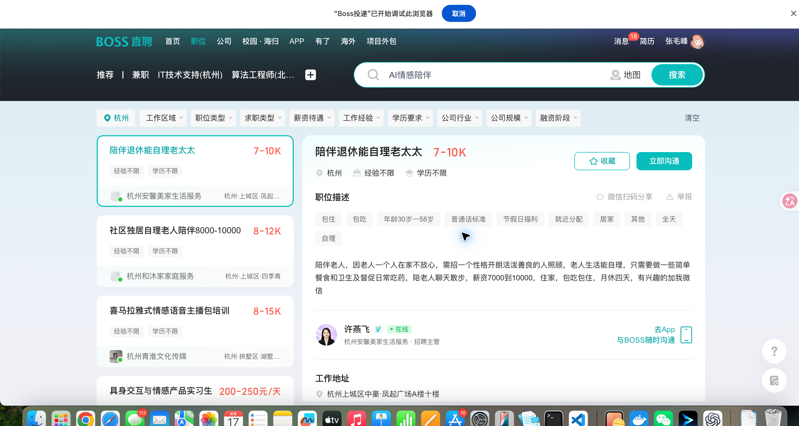
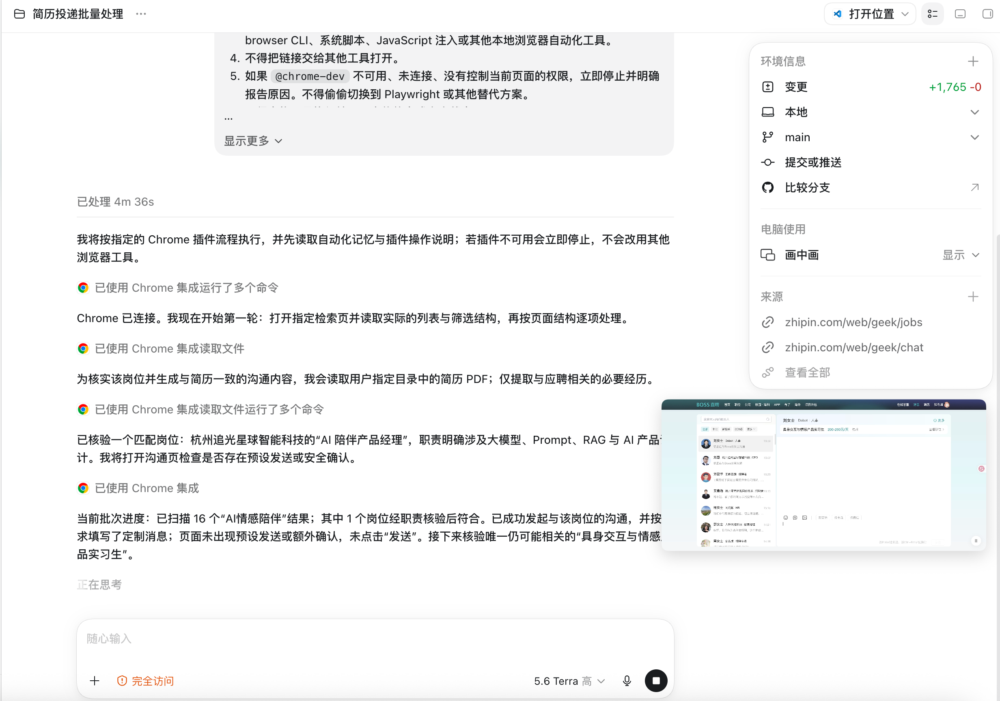
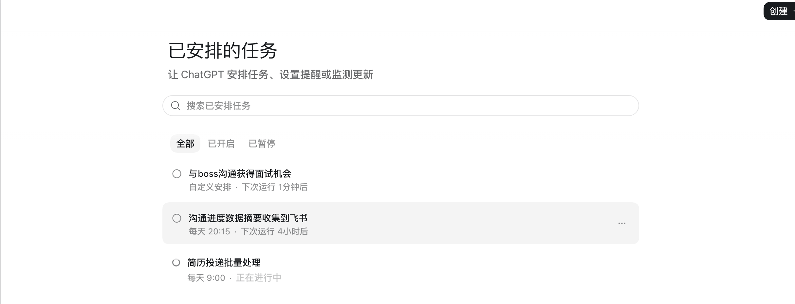

# Boss投递

Boss投递是一个配合 Codex 使用的 Chrome 插件，可以在你当前登录的 BOSS 直聘页面中读取岗位、筛选职位、整理沟通内容并跟进求职进度。

Boss投递负责控制 Chrome；实际的 Prompt 任务、辅助脚本、配置和任务数据位于独立仓库 [boss-agent-run-job](https://github.com/glide-the/boss-agent-run-job)。运行任务前，必须先把它下载到固定路径：

## 使用前准备

1. 按照 [安装说明](docs/manual-install.md) 完成 Boss投递安装。
2. 在 Chrome 中登录 BOSS 直聘。
3. 打开需要处理的岗位列表、职位详情或聊天页面。
4. 确认 Chrome 已启用“Boss投递”扩展。

如果页面顶部显示“Boss投递已开始调试此浏览器”，说明插件已经取得当前浏览器的控制权限。



## 第一次使用

建议先执行一次只读测试。在 Codex 中输入：

```text
使用 Boss投递检查当前 BOSS 直聘页面，并汇总可见岗位信息。只读取，不发起沟通或投递。
```

正常情况下，Codex 会返回当前页面、可见岗位数量以及岗位摘要。如果插件未连接、BOSS 未登录或没有当前页面权限，任务应该停止并说明原因。

## 常用方法

### 汇总当前岗位

```text
使用 Boss投递读取当前页面的可见岗位，整理岗位名称、公司、地点、薪资、经验要求和职位亮点。不要发送消息或投递简历。
```

### 按条件筛选

```text
使用 Boss投递搜索“AI 产品经理”，地点杭州。按照岗位匹配度、薪资、经验要求和公司情况生成候选清单，先不要投递。
```

### 根据简历判断匹配度

```text
读取我指定的简历，只提取和求职相关的信息。对当前候选岗位逐一判断匹配度，并说明匹配理由、缺口和建议优先级。不要发送或投递。
```

### 草拟沟通消息

```text
为前三个候选岗位分别草拟一条沟通消息。展示岗位、匹配理由和消息正文，等待我确认后再进行任何发送。
```

## 批量处理

批量处理时，建议让 Codex 分成“读取、筛选、草拟、确认、执行”五个阶段，并限制每轮处理数量。

```text
使用 Boss投递扫描当前搜索结果，每轮最多处理 10 个岗位。先生成候选清单，再为符合条件的岗位草拟沟通消息。没有得到我的明确确认前，不要点击发送或投递。
```

Codex 会在同一个任务中展示 Chrome 操作、岗位处理进度和当前结果：



## 定时任务

可以使用 Codex 定时任务定期汇总岗位或沟通进度。建议定时任务默认只读取和整理，不自动发送消息或投递简历。

```text
每天 20:15 使用 Boss投递汇总今天已沟通岗位的可见进度，只生成摘要，不发送消息、不投递简历。如果 Chrome 未连接或 BOSS 未登录，记录原因后停止。
```



## 发送或投递前

需要产生外部影响时，请确认：

- 目标岗位是否正确；
- 使用的简历是否正确；
- 消息正文是否符合你的真实经历；
- 本轮允许发送或投递的数量；
- 是否存在重复沟通或重复投递。

页面没有额外确认按钮，并不表示可以跳过 Codex 中的人工确认。

## 插件连接不上

先在 Codex 输入：

```text
检查 Boss投递 Chrome 扩展是否已连接。只进行检查，不操作 BOSS 页面；如果失败，请说明失败在哪一步并给出修复方法。
```

仍然失败时：

1. 打开 `chrome://extensions/`，确认 Boss投递已启用；
2. 点击 Boss投递卡片上的“重新加载”；
3. 刷新 BOSS 页面后重新执行只读测试；
4. 按 [安装说明中的常见故障](docs/manual-install.md#八常见故障) 继续检查。

如果 Boss投递不可用，不要让任务自动改用其他浏览器工具继续操作。

## 使用原则

- 默认先读取、筛选和草拟，再确认是否执行；
- 不要让生成的沟通内容虚构工作经历或技能；
- 批量任务应限制数量，并记录已经处理的岗位；
- 遇到登录、验证码、风控或页面结构异常时停止操作；
- 使用时应遵守 BOSS 直聘的服务规则和适用法律。

## 相关内容

- [本地安装与排障](docs/manual-install.md)
- [项目完整开发过程与复线](docs/development-history.md)
- [开发类似 Chrome 自动化插件](docs/plugin-development-guide.md)
- [Notion「Boss」项目](https://app.notion.com/p/Boss-38d30b7547c380478319d3d5d6812ac3?source=copy_link)
