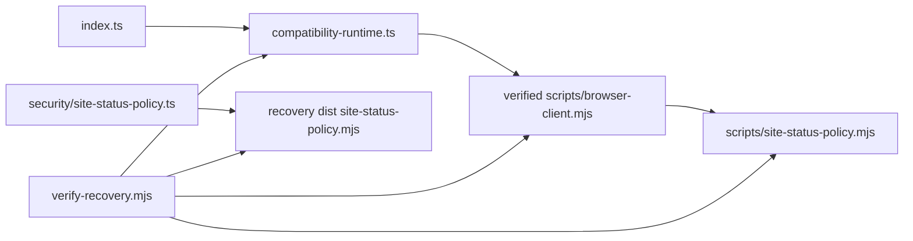

# Browser Client 模块与 MJS 清单

## 顶层 `.mjs` 文件

基线采集时间：2026-08-18，目标为当前工作树而非 Git HEAD。

| 文件 | bytes | SHA-256 | 职责 | 来源与分类 |
|---|---:|---|---|---|
| `scripts/browser-client.mjs` | 989,621 | `cf71c5bf138839ff6f6df07328a63d6897458f122ed68ee0bf496e301cc06c45` | Browser Runtime、Browser/Tab API、JSON-RPC、CDP/Playwright、安全策略与 node_repl bootstrap | esbuild-like 打包/压缩构建物；含第三方内联代码和项目 `site_status` 窄补丁；需要分阶段恢复业务模块 |
| `scripts/installManifest.mjs` | 12,428 | `b735d116d82fbee45afc32de5bfeb59976a7692d0659aaa947ce5eee94ee7ded` | 安装 Native Host/扩展 manifest 并解析插件路径 | 可维护的项目脚本，可直接保留 |
| `scripts/patch-browser-client-site-status.mjs` | 4,145 | `c5a0a2e76de7d3e5980dc2b9b8178334729df7fd636f8aa6a9ed55e82b052783` | 对上游 bundle 应用/校验本地 `site_status` 窄补丁 | 当前项目新增适配模块，可直接保留到源码接入完成 |
| `scripts/site-status-policy.mjs` | 9,526 | `74998781d56cd9f52c02f32848f7b85b0e882e0bd0415f7fea7987250187bc5d` | 默认关闭、loopback-only、fail-open、cache/inflight 合并 | 当前项目新增的独立可维护模块；已恢复为 TypeScript |
| `scripts/verify-standalone.mjs` | 8,575 | `eaa1eb28cc5452754c67c6cc5a5e527413c31167d0b4fdffc7c583c18f1d6bd9` | standalone 插件身份、manifest、文件布局和安全补丁检查 | 可维护的项目验证脚本，可直接保留 |

补充：`scripts/node_modules/classic-level.mjs` 位于子目录，是 vendored runtime dependency 的 ESM 入口，不属于顶层业务 `.mjs`；不应人工重写。

## Git 与历史来源

- Git 历史对 `browser-client.mjs` 只有初始导入提交 `0bdb0e8`，没有原始 TypeScript 模块历史。
- Git HEAD blob 大小 990,858 bytes，SHA-256 为 `ba7d5056235118520afd460b2c86a4ab6952856619cab8187543f295714f932a`。
- 该 HEAD blob 与本机 `codex-chrome-automation-local/chrome-dev/26.707.30751-standalone.3` cache 中的 bundle 字节完全一致。cache 只作为来源佐证，不作为恢复构建依赖。
- 当前工作树 bundle 是用户已有的 `site_status` 补丁版本；恢复工程没有覆盖它。
- 另有 `openai-bundled/browser/26.715.31925` 的更新 bundle，大小 993,697 bytes、SHA-256 `461c4ba94b821ec805da79c8e8138fe510b1b3358609fc93da47387a2cf3fbf3`，版本不同，不能作为当前文件的原始源码。

## Source Map 与打包特征

- 当前 Browser Client 文件及插件目录没有对应 `.map`。
- 文件中没有 `sourceMappingURL`、`sourcesContent`、`webpack://` 或 `vite://`。
- 没有发现可用原始模块路径或 debug build。
- helper prelude 和 lazy CommonJS wrapper 形态与 esbuild 一致，但缺少构建元数据，因此打包器结论为 inferred。
- module system 为 Node ESM；bundle 内同时包含 CommonJS compatibility wrappers。

## 业务模块候选

| 候选模块 | AST/字符串锚点 | 分类 | 第一阶段状态 |
|---|---|---|---|
| Process Shim | `const processShim`，line 5 | confirmed | 保留兼容内核 |
| JSON-RPC | `No handler registered for method`，line 76 | confirmed | 待恢复 |
| Browser API Schema | `BrowserAuthHandoffCommand`，line 76 | confirmed | 待恢复 |
| Telemetry | `browser_use.command.execute`，line 76 | confirmed | 待恢复 |
| Browser Security | `ensureUrlOriginConsentAllowed`，line 3247 | confirmed | `site_status` 已恢复，其余待恢复 |
| Clipboard Bridge | `Browser Use clipboard bridge`，line 3247 | confirmed | 保留兼容内核 |
| Runtime Bridge | `browser_use_invocation_started`，line 3255 | confirmed | contract/compat adapter 已恢复 |
| Public Entry | `ATe as setupBrowserRuntime`，line 3255 | confirmed | 候选导出一致 |

## 第三方内联代码

| 依赖 | 证据 | 处理 |
|---|---|---|
| punycode 2.3.1 | 版本 literal 与相邻实现，line 39 | 不人工重写 |
| Statsig JavaScript SDK 3.32.6 | `SDK_VERSION` 与 `[Statsig]`，line 39 | 不人工重写 |
| Zod | `ZodError` 与 schema runtime，line 63 | 不人工重写 |
| classic-level/abstract-level | 独立 vendored `scripts/node_modules` 与 bundle import | 直接保留 |

## 恢复源码职责

| 源码 | 职责 | 性质 |
|---|---|---|
| `src/browser-client/index.ts` | 保持唯一公开入口 | reconstructed |
| `src/browser-client/contracts/runtime.ts` | `setupBrowserRuntime` 的最小类型边界 | reconstructed |
| `src/browser-client/runtime/compatibility-runtime.ts` | 委托未恢复行为给已验证 bundle | reconstructed、显式过渡层 |
| `src/browser-client/security/site-status-policy.ts` | 强类型恢复本地安全策略 | confirmed behavior + reconstructed types |

依赖关系：

