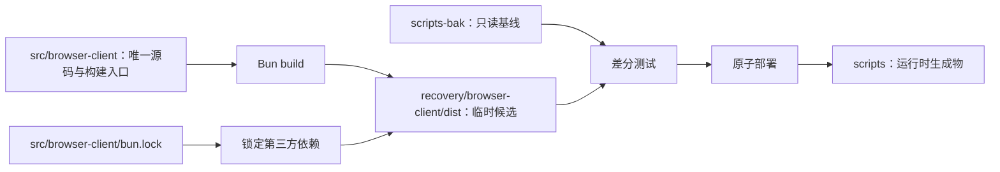

# Browser Client 文件与源码覆盖清单

规范来源：`docs/browser-client-source-layout.md`。本清单记录当前已部署实现，避免把语义等价兼容内核误报为作者原始 TypeScript。

## 1. 当前结论

当前 `scripts` 有 12 个 manifest 管理的第一方顶层文件，以及一个由 Bun lock 管理的 vendored runtime dependency tree。12 个顶层文件均来自 `src/browser-client`，旧基线和旧工具目录均不在生产依赖图中。

| 产物 | 分类 | canonical 来源 | 构建/验证状态 |
|---|---|---|---|
| `browser-client.mjs` | 第一方业务入口 | `index.ts`、已提取 TS 模块、`browser-runtime.generated.js` | Bun ESM；唯一导出和 setup 双运行差分通过 |
| `check-extension-installed.js` | 第一方 CLI | `scripts/check-extension-installed.ts` | strict TS；CLI 差分通过 |
| `check-native-host-manifest.js` | 第一方 CLI | `scripts/check-native-host-manifest.ts` | strict TS；CLI 差分通过 |
| `chrome-is-running.js` | 第一方 CLI | `scripts/chrome-is-running.ts` | strict TS；CLI 差分通过 |
| `installed-browsers.js` | 第一方 CLI | `scripts/installed-browsers.ts` | strict TS；CLI 差分通过 |
| `installManifest.mjs` | 第一方安装模块 | `scripts/install-manifest.ts` | strict TS；结构化差分通过 |
| `open-chrome-window.js` | 第一方 CLI | `scripts/open-chrome-window.ts` | strict TS；dry-run 差分通过 |
| `patch-browser-client-site-status.mjs` | 第一方恢复工具 | `scripts/patch-browser-client-site-status.ts` | strict TS；patch/check 差分通过 |
| `site-status-policy.mjs` | 第一方安全模块 | `security/site-status-policy.ts` | strict TS；16 项现有测试覆盖其行为 |
| `verify-standalone.mjs` | 第一方校验 CLI | `scripts/verify-standalone.ts` | strict TS；三档身份验证通过 |
| `extension-id.json` | 第一方配置 | `config/extension-id.json` | 复制并逐字节校验 |
| `standalone-identity.json` | 第一方配置 | `config/standalone-identity.json` | 复制并逐字节校验 |
| `node_modules/classic-level.mjs` | 第一方 adapter/第三方边界 | `vendor/classic-level-adapter.ts` | Bun 生成，加载锁定依赖 |
| `node_modules/**` | 第三方 runtime | `bun.lock` + canonical signed prebuild | 331 个非 adapter 文件与基线一致；签名资产验签通过 |

## 2. 不可变基线

`components/codex-plugin/scripts-bak` 是修改前完整副本，共 344 个文件，树 SHA-256 为 `85d1bc4f7d456ef75eceab7df6159ebfdfce23de0af51175ec9ba2dc9e579964`。它只用于：

- AST 和语义证据；
- 行为差分；
- 紧急回滚。

它禁止作为 `browser-client.mjs` 的生产 import、虚拟模块或嵌入内核。

## 3. Browser Client 主体证据

基线 `browser-client.mjs`：989,621 bytes，SHA-256 `cf71c5bf138839ff6f6df07328a63d6897458f122ed68ee0bf496e301cc06c45`。没有 Source Map、`sourcesContent`、原始模块路径或 debug build。

| 模块候选 | 证据锚点 | 分类 | 状态 |
|---|---|---|---|
| Process Shim | `const processShim` | confirmed | `runtime/process-shim.ts` 已提取并接入 |
| JSON-RPC | `No handler registered for method` | confirmed | 待恢复 |
| Browser API Schema | `BrowserAuthHandoffCommand` | confirmed | 待恢复 |
| Telemetry | `browser_use.command.execute` | confirmed | 待恢复 |
| Browser Security | `ensureUrlOriginConsentAllowed` | confirmed | `security/browser-security.ts` 已提取并接入 |
| Clipboard Bridge | `Browser Use clipboard bridge` | confirmed | 待恢复或明确隔离 |
| Runtime Bridge | `browser_use_invocation_started` | confirmed | node_repl display bridge 已提取；其余协议内核保留在兼容 JS |
| Browser/Tab API | `tab.goto` 与 tab manager 委托 | reconstructed | `runtime/tabs.ts` 已提取并接入 |
| Public Entry | `setupBrowserRuntime` | confirmed | canonical bundle 唯一导出；mock setup 双运行快照通过 |

第三方内联签名包括 punycode 2.3.1、Statsig JavaScript SDK 3.32.6 和 Zod runtime。无法证明拆包后初始化行为等价的部分仍留在兼容内核，不能冒充第一方手写源码。

## 4. 目标依赖关系

生产依赖只能沿 `Source/Lock → Builder → Stage → Scripts` 流动；`scripts-bak → BrowserBundle` 属于禁止边。
