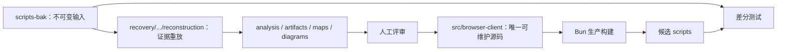

# Browser Client 可复现恢复工程规范

## 1. 目的

在 `components/codex-plugin/src/browser-client` 接管生产构建之前，先交付一套可以由开发者独立复跑、检查和打包的恢复工程。它参考：

```text
/Users/dmeck/project/CodexChromePlug/codex-1.1.5_0/
  codex-extension-source-recovery-ts-react-full-verification/reconstruction
```

复用参考工程的阶段报告、结构化 artifacts、语义 maps、Mermaid diagrams、可执行 scripts 和本地验证模型；不复制其 Chrome Extension 专用结论，也不沿用正则承担 AST 解析。

## 2. 目录

```text
recovery/browser-client/reconstruction/
├── README.md
├── TASK_PLANNING.md
├── LOCAL_VERIFICATION.md
├── SECURITY.md
├── package.json
├── bun.lock
├── input-manifest.json
├── analysis/
│   ├── 00-sample-info.md
│   ├── 01-sourcemap-check.md
│   ├── 02-file-inventory.md
│   ├── 03-bundle-fingerprint.md
│   ├── 04-ast-static-index.md
│   ├── 05-protocol-and-security-index.md
│   ├── 06-semantic-renaming.md
│   ├── 07-module-reconstruction-plan.md
│   ├── 08-runtime-differential-validation.md
│   ├── 09-confidence-report.md
│   └── 10-limitations.md
├── artifacts/
│   ├── file-inventory.csv
│   ├── js-file-metrics.csv
│   ├── sourcemap-check.json
│   ├── ast-inventory.json
│   ├── exports.json
│   ├── imports.json
│   ├── declarations.csv
│   ├── functions.csv
│   ├── classes.csv
│   ├── protocol-strings.csv
│   ├── call-graph.json
│   ├── security-call-graph.json
│   ├── third-party-boundaries.json
│   └── reconstruction-summary.json
├── diagrams/
│   ├── recovery-pipeline.mmd
│   ├── runtime-protocol.mmd
│   └── module-dependencies.mmd
├── maps/
│   ├── browser-client.semantic-map.json
│   ├── materialized-runtime-map.json
│   ├── third-party-runtime-assets.json
│   ├── utility-scripts.semantic-map.json
│   └── module-boundaries.json
└── scripts/
    ├── reconstruct.mjs
    ├── extract-ast.mjs
    ├── materialize-browser-runtime.mjs
    ├── materialize-third-party-assets.mjs
    ├── materialize-utility-sources.mjs
    ├── verify-artifacts.mjs
    └── package-reconstruction.mjs
```

## 3. 与生产源码的边界

恢复工程与生产构建是两条不同链路：



- `reconstruction/scripts` 可以读取 `scripts-bak`，因为它的职责就是重放恢复证据。
- `src/browser-client/build` 禁止读取或嵌入 `scripts-bak`；它只构建已评审源码。
- `reconstruction` 不保存第二份生产源码。语义 map 的目标路径直接指向 `components/codex-plugin/src/browser-client`。
- `recovery/browser-client/dist` 是临时候选，不是源码，也不进入版本升级的人工编辑流程。

## 4. 语义 map 证据格式

每个重命名或模块边界至少记录：

```json
{
  "source": "components/codex-plugin/scripts-bak/browser-client.mjs",
  "range": { "start": 0, "end": 86, "line": 1 },
  "originalIdentifier": "ATe",
  "reconstructedName": "setupBrowserRuntime",
  "targetModule": "components/codex-plugin/src/browser-client/index.ts",
  "classification": "confirmed",
  "confidence": 1,
  "evidence": ["ESM export table", "runtime invocation anchor"],
  "verification": ["export snapshot", "import smoke"]
}
```

`classification` 只能是 `confirmed`、`inferred`、`reconstructed`、`unresolved`。没有范围、证据和验证方式的命名不能进入 high-confidence map。

## 5. 可复跑命令

全部恢复工具使用 Bun，避免再引入一套 Python/npm 生产依赖：

```bash
cd /Users/dmeck/project/boss-agent-work/develop/recovery/browser-client/reconstruction
bun install --frozen-lockfile

# 从 scripts-bak 重新生成 analysis/artifacts/maps 的机器生成部分
bun run reproduce

# 验证输入哈希、JSON/CSV schema、AST 统计、语义 map 范围和文档引用
bun run verify

# 在临时目录生成包含恢复资源、canonical source、当前候选和不可变输入的便携验证包
bun run package --output /tmp/browser-client-reconstruction-check --include-input
```

`reproduce` 必须幂等：连续运行两次，除明确的时间戳字段外，受管 artifacts 的 SHA-256 不变。默认不改 `src/browser-client`、`scripts` 或 `scripts-bak`。

## 6. 参考工程步骤映射

| 参考工程步骤 | Browser Client 对应步骤 |
|---|---|
| sample info | 记录 12 个顶层文件、vendor tree、哈希和模式 |
| sourcemap check | 查找 `.map`、`sourceMappingURL`、`sourcesContent` 和原始路径 |
| manifest analysis | 分析 plugin identity、docs schema、extension/native-host 配置 |
| bundle fingerprint | AST 数量、import/export、字符串、构建器特征 |
| static index | 函数/class/声明/协议/安全调用图 |
| semantic renaming | 每个名字附原 AST range、证据和置信度 |
| reconstruction plan | 映射到 `src/browser-client` 唯一模块树 |
| runtime validation | 基线/源码构建双运行、Mock transport、导入和安全差分 |
| confidence report | confirmed/inferred/reconstructed/unresolved 汇总 |
| limitations | 明确没有原始源码和未执行真实网站验证 |

## 7. 前置验收

生产构建迁移前必须通过：

```text
reconstruction 目录和五类资源齐全                    PASS
输入 manifest 与 scripts-bak 树哈希一致               PASS
TypeScript Compiler API 完整 AST 解析                  PASS
artifacts 可从脚本重新生成且 schema 合法                PASS
semantic maps 的 range、证据和目标模块可校验            PASS
三张 Mermaid 图存在且参与文档引用                       PASS
reproduce 连续两次结果稳定                             PASS
便携验证包可在临时目录生成                             PASS
恢复脚本不修改 src、scripts 或 scripts-bak              PASS
```

2026-08-18 实际重放结果：14 个机器生成 artifact、11 份分析报告、3 张 Mermaid 图，输入树哈希为 `85d1bc4f7d456ef75eceab7df6159ebfdfce23de0af51175ec9ba2dc9e579964`，三棵受保护树保持不变。该门槛通过后，`Makefile` 已迁移、`scripts` 已切换，旧工具目录已删除。
