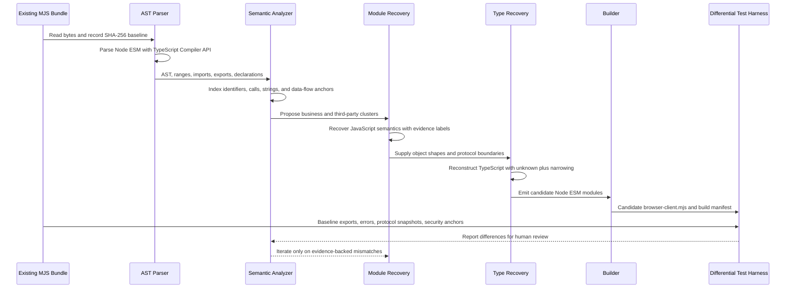
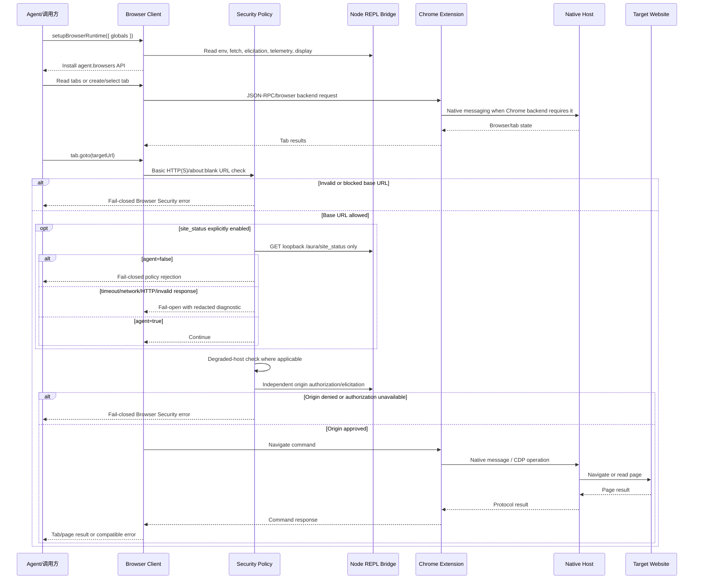

# Browser Client 可维护源码恢复设计

## 1. 背景与结论

`components/codex-plugin/scripts/browser-client.mjs` 是一个约 0.99 MB 的 Node ESM 单文件构建物。当前样本没有 Source Map、`sourcesContent`、原始模块路径或可证明的上游开发源码，因此本工程只能交付“语义等价源码恢复”或“可维护模块化重建”，不能声称恢复了作者的字节级原始源码。

当前推荐方案是分阶段恢复：保留已验证 bundle 作为兼容内核，先恢复安全策略、命令路由边界和 Runtime Bridge 等可独立验证领域；第三方内联代码不人工重写。第一阶段已实现真正的 AST 分析、强类型 `site_status` 策略、兼容入口、独立候选构建和差分验证，但 marketplace 尚未切换到候选入口。

## 2. 目标与非目标

目标：

- 建立可重复运行的 AST 证据提取流程。
- 区分 confirmed、inferred、reconstructed 和 unresolved 信息。
- 保持唯一公开导出 `setupBrowserRuntime`。
- 保持 Browser/Tab API、URL 安全检查、origin 授权、文件传输授权、CDP 授权和桥接协议。
- 保持 `site_status` 默认关闭、启用时只允许 loopback、运行故障 fail-open、配置错误 fail-closed、24 小时成功缓存和同 host 并发合并。
- 保持 `/aura/identity` 现有行为。
- 在独立目录构建候选产物，验收前不覆盖现行 bundle。

非目标：

- 伪造原始文件名、局部变量名、注释或 TypeScript 泛型。
- 手工重写 Statsig、Zod、punycode 等第三方依赖。
- 修改 Chrome Extension、Native Host、Browser Client 协议或插件身份。
- 引入 UI、远程服务、数据库、消息队列、配置中心或新插件框架。
- 未经授权执行真实浏览器或外部网站验证。

## 3. 当前 bundle 架构判断

AST 基线见 `recovery/browser-client/analysis/bundle-fingerprint.json`：

- SHA-256：`cf71c5bf138839ff6f6df07328a63d6897458f122ed68ee0bf496e301cc06c45`。
- 989,621 bytes，3,256 个物理行；大量代码仍位于超长行中。
- TypeScript Compiler API 6.0.3 解析诊断为 0。
- 71 个 ESM import，主要是 Node 标准库，另有 `classic-level.mjs` 和项目新增的 `site-status-policy.mjs`。
- 唯一公开导出是 `ATe as setupBrowserRuntime`。
- 2,566 个顶层声明、4,787 个函数样节点、135 个 class 和 11,213 个静态调用。
- 运行目标是 Node ESM / node_repl；包含 process shim、Node 标准库、JSON-RPC、CDP/Playwright、Chrome/IAB/extension 后端和文档 API。
- 打包器推断为 esbuild，依据是 helper prelude、lazy CommonJS wrapper 和单文件 minified ESM 形态；由于没有构建元数据，该项只能标为 inferred。

可确认的主要领域：

1. process/standalone shim。
2. 第三方 SDK 与 schema runtime。
3. JSON-RPC endpoint 和 transport。
4. Browser/Tab command schema 与 dispatch。
5. telemetry/tracing。
6. Browser Security。
7. CDP、Playwright、clipboard、page assets。
8. Browser registry 与 Chrome/IAB/extension backend selection。
9. Node REPL Runtime Bridge 和 `setupBrowserRuntime`。
10. 项目新增的本地 `site_status` policy adapter。

## 4. 参考恢复工程的复用范围

参考工程提供了正确的边界声明、Source Map 检查、字符串/API 索引、语义命名证据表、置信度分级、TypeScript typecheck 和运行时验证清单。本工程复用这些原则，但作了两点收紧：

- 参考工程的部分“AST-like”脚本明确使用正则，只适合锚点扫描；本工程使用 TypeScript Compiler API 完整解析语法树，正则只用于已解析字符串的分类，绝不承担语法解析。
- 本工程不立即重写整个大 bundle，而先以可执行差分测试替代“看起来合理”的全量重写。

## 5. 证据与可信度

- `confirmed`：直接来自 AST、ESM 导出、字符串、Git blob、哈希或测试结果。
- `inferred`：由 helper 形态、调用关系或数据流推断，仍可能存在替代解释。
- `reconstructed`：为可维护性新命名、新拆分或补充的类型。
- `unresolved`：当前证据无法可靠确定。

每个恢复模块应在 `docs/browser-client-recovery-evidence.md` 记录原 AST offset/line、证据、置信度和验证方式。

## 6. AST 到 JavaScript 语义恢复

1. 对输入文件做大小和 SHA-256 锁定。
2. 用 TypeScript Compiler API 以 `ScriptKind.JS`/`ESNext` 解析。
3. 提取 import/export、顶层声明、函数、class、协议字符串和静态调用边。
4. 使用错误文本、command type、环境变量、对象形状和调用顺序建立模块候选。
5. 将第三方版本签名与业务锚点分开。
6. 只对具有多条证据的模块进行语义命名。
7. 动态代理、反射调用和 transport dispatch 标为静态分析盲区，交给差分测试。

结构化输出位于：

```text
recovery/browser-client/analysis/
├── ast-inventory.json
├── bundle-fingerprint.json
├── call-graph.json
├── module-boundaries.json
└── protocol-string-index.json
```

## 7. JavaScript 到 TypeScript/模块源码

恢复顺序按风险从低到高：

1. 已独立、已有单测的 `site-status-policy`。
2. 公开 Runtime contract 和兼容入口。
3. Browser Security command classifier 与授权顺序。
4. JSON-RPC/Node REPL Runtime Bridge。
5. Browser/Tab API facade 和命令路由。
6. CDP/Playwright adapter。
7. 仅在依赖边界明确后，将第三方代码恢复为 Bun 锁定的正常 package dependency；否则继续留在兼容内核。

类型恢复优先使用 `unknown`、判别联合和运行时收窄。只有 AST/文档 schema/测试共同支持时才定义具体字段。禁止用 `any` 掩盖动态边界。

## 8. 目录设计

```text
components/codex-plugin/src/browser-client/
├── contracts/runtime.ts
├── index.ts
├── runtime/compatibility-runtime.ts
├── security/site-status-policy.ts
└── tsconfig.json

tools/browser-client-recovery/
├── analyze-browser-client.mjs
├── build-recovered-source.mjs
├── verify-recovery.mjs
├── bun.lock
├── package.json
└── README.md

recovery/browser-client/
├── analysis/
├── fixtures/baseline-manifest.json
└── dist/
    ├── browser-client.mjs
    ├── build-manifest.json
    └── security/site-status-policy.mjs
```

`scripts/browser-client.mjs` 仍是现行已验证生成物；`recovery/browser-client/dist/browser-client.mjs` 是阶段一候选，不进入当前 marketplace。

## 9. 类型与命名策略

- `SetupBrowserRuntimeOptions`：reconstructed。来自 `setupBrowserRuntime` 唯一导出及入口参数解构。
- `BrowserRuntimeGlobals`：reconstructed。保留开放 record，因为 `globalThis` 注入面是动态的。
- `SiteStatusRequest`、`SiteStatusDiagnostic`：reconstructed，但字段直接来自现有独立模块。
- `BrowserBackend`：部分 confirmed（`chrome`、`iab`、`cdp`），保留 `string` 以避免把推断变成破坏性约束。
- 压缩符号如 `ATe` 不全局重命名；只有迁出到独立模块后才使用语义名。

## 10. 第三方依赖隔离

当前直接确认的内联签名包括 punycode 2.3.1、Statsig JavaScript SDK 3.32.6 和 Zod runtime。它们不属于 Browser Client 业务源码恢复范围。后续如要去内联，必须先证明 package 版本、初始化参数、tree-shaking 条件和异常行为一致，再以 Bun 锁文件依赖替代；否则保留兼容内核。

## 11. 构建工具与输出

包管理器和脚本运行时固定为 Bun 1.2.20，`bun.lock` 锁定 TypeScript 6.0.3。构建器先通过 TypeScript Compiler API 执行完整 strict typecheck，再调用 `Bun.build` 生成两个真实 Node ESM bundle：唯一公开入口 `browser-client.mjs` 和用于独立差分的 `security/site-status-policy.mjs`。build manifest 同时记录 Bun/TypeScript 版本、bundler 参数、源码哈希、基线哈希以及每个产物的大小和哈希。

```bash
cd tools/browser-client-recovery
bun install --frozen-lockfile --ignore-scripts
bun run analyze
bun run build
bun run verify
# 或一次执行完整检查：bun run check
```

第一阶段候选不是自包含全量重建：其未恢复行为通过 compatibility runtime 委托给现行 bundle。该事实写入源码注释和 build manifest。

## 12. 导出 API 兼容

基线和候选都只导出：

```text
setupBrowserRuntime
```

恢复内部模块不从 Browser Client 入口额外导出，避免改变调用方面。候选导入验证、bundle 内联检查、基线 URL 解析和 export 集合差分已纳入 `bun run verify`。

## 13. 协议边界

- Agent/调用方只依赖 `setupBrowserRuntime` 安装的 `agent`/Browser API。
- Browser Client 负责 command schema、dispatch、安全检查、backend selection 和结果元数据。
- Node REPL Bridge 提供环境变量、fetch、elicitation、telemetry、display 和 response metadata。
- Chrome Extension 与 Native Host 的消息协议由现行 bundle/扩展实现保持，不在第一阶段重写。
- CDP/Playwright 是 Browser Client 到 browser backend 的动态边界，静态调用图不能证明其全部行为。

## 14. `site_status` 迁移

强类型恢复版保持以下顺序和行为：

1. 未设置或 `false` 时立即返回，不读取/校验 base URL，不发请求。
2. `true` 时 base URL 只允许 `127.0.0.1`、`localhost`、`[::1]` 的 HTTP(S)，拒绝凭据、query 和 fragment。
3. localhost 目标页面不做 site status 查询。
4. 请求只发送到本地 `/aura/site_status`。
5. 网络、超时、HTTP、JSON 和协议错误 fail-open，并输出脱敏诊断。
6. 无效安全配置 fail-closed。
7. 成功决策按去除 `www.` 的 host 缓存 24 小时；同 host 并发合并。
8. `agent=false` 保留调用方创建的 Browser Security 错误包装。

不得恢复 ChatGPT `site_status` 回退。`/aura/identity` 属于另一条已存在链路，保持不变。

## 15. 错误、缓存和安全兼容

恢复模块必须保留：

- 原错误 message 和 error class（可验证部分）。
- `Browser Use rejected this action...` 安全错误包装。
- URL 基础策略、site status、degraded host、origin consent 的既有先后顺序。
- 文件 upload/download 和 page asset 的独立授权。
- full CDP 和 raw CDP destination 的独立授权。
- 成功缓存、不缓存失败、TTL 和 inflight promise 合并。

## 16. 差分测试模型

验证层级：

1. AST 可解析和静态锚点。
2. 基线哈希锁。
3. Browser Client export 集合与 import smoke。
4. 恢复 `site_status` 与现行 `.mjs` 双运行快照。
5. 安全调用链锚点与 remote fallback 负断言。
6. 项目现有单测和 patch check。
7. 三档 marketplace 构建与 standalone 身份检查。
8. 真实浏览器/网站仅在明确授权后执行。

第一阶段未声称验证 Browser/Tab 全对象运行行为；兼容入口委托同一基线内核，因此该部分没有独立实现差异，但也不是全量恢复完成的证据。

## 17. 构建可重复性

- `packageManager: bun@1.2.20` 与 `bun.lock` 锁定包管理器和 TypeScript 包。
- `Bun.build` 参数固定为 `target: node`、`format: esm`、`splitting: false`、`minify: false`、`sourcemap: none`。
- build manifest 记录 TypeScript 版本、全部恢复源码 SHA-256、基线 SHA-256 和发射文件。
- `fixtures/baseline-manifest.json` 将保留原位的现行 bundle 作为 hash-locked fixture，避免复制或覆盖近 1 MB 文件。
- 工具不依赖 Codex plugin cache；cache 仅作为历史来源比对证据。
- 分析和构建都从仓库内明确路径读取。
- 产物进入独立 `recovery/`，不会隐式覆盖现行 bundle。

## 18. 上游升级与 bundle 漂移

每次上游 bundle 变化时：

1. 先运行 analyzer 生成新 fingerprint。
2. 比较 import/export、command 字符串、安全锚点和模块候选。
3. 若公开导出或安全调用顺序变化，停止自动接入并人工评审。
4. 更新证据映射和差分 fixture。
5. 仅在 candidate 全部通过后更新 assembly 入口。

`verify-recovery.mjs` 会在当前 bundle 与已记录 AST 哈希不一致时失败，防止静默漂移。

## 19. 源码恢复流水线



## 20. 恢复后运行时业务流程



## 21. 防过度设计评审

评审结论：通过第一阶段实施，暂不批准全量替换。

- 满足“可维护源码恢复”：有真实 AST、证据表、TypeScript 模块和可运行差分，不是只格式化 minified bundle。
- 能生成兼容候选 `browser-client.mjs`，但当前候选仍委托兼容内核，不能描述为完整独立重建。
- 公开导出保持一致。
- confirmed 与 inferred 已分离；没有将 reconstructed 命名描述为作者原名。
- 第三方依赖未重写。
- 没有引入框架、UI、服务或协议变更。
- 最小可行范围是 `site_status`、runtime contract、兼容入口和 AST/差分工具。
- 可按 Security → Runtime Bridge → Command Router → CDP/Playwright 分阶段扩大。
- 当前 marketplace 仍使用已验证 bundle，回退成本为零。

## 22. 验收、限制与回滚

第一阶段已满足：AST 零诊断、公开导出一致、候选可导入、TypeScript strict build、重复构建哈希一致、`site_status` 双运行差分、安全锚点检查、现有 16 个策略单测、三档现行 marketplace 组装和三档 standalone 身份检查。

尚未满足：独立恢复 Browser/Tab 完整对象、完整 mock transport 双运行、三档 marketplace **新候选入口**接入、真实浏览器验证。因此不得切换现行入口，也不得声称全量语义等价已经证明。已经通过的 marketplace/standalone 验证使用现行兼容 bundle，不等于候选已获生产接入批准。

回滚方式：保持 `scripts/browser-client.mjs` 和现有 assembly 不变；删除或忽略 `src/browser-client`、`tools/browser-client-recovery` 和 `recovery/browser-client` 即可。第一阶段没有修改 Chrome/Native Host 注册，也没有提交或推送。
