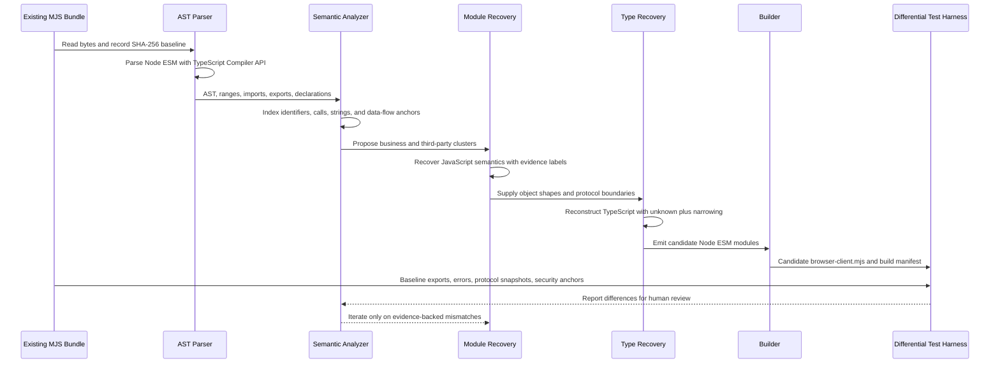
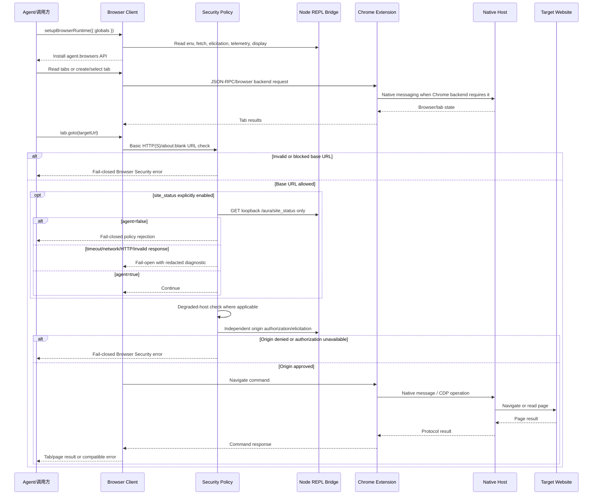

# Browser Client 可维护源码恢复设计

## 1. 背景与结论

`components/codex-plugin/scripts/browser-client.mjs` 是一个约 0.99 MB 的 Node ESM 单文件构建物。当前样本没有 Source Map、`sourcesContent`、原始模块路径或可证明的上游开发源码，因此本工程只能交付“语义等价源码恢复”或“可维护模块化重建”，不能声称恢复了作者的字节级原始源码。

2026-08-18 复审发现旧实现只是局部恢复：五个 `.mjs` 由 Bun 发射，但 `index.ts` 把 `scripts-bak/browser-client.mjs` 作为兼容内核重新嵌入，另有五个第一方 `.js` 和两个 JSON 未纳入统一源码构建。因此旧实现不能称为完整恢复。

本轮已完成生产迁移：旧基线嵌入被移除，12 个第一方顶层文件有唯一 canonical 来源，5 个缺失 CLI 已恢复为严格 TypeScript，核心 Process/Tab/Security/node_repl display 模块已从格式化兼容内核提取并实际进入 Bun 依赖图。剩余无法可靠拆分的运行时和内联第三方代码继续以可审计 JavaScript 保存；这不等同于找回作者完整 TypeScript。

新的强制目录规范见 `docs/browser-client-source-layout.md`：`components/codex-plugin/src/browser-client` 是唯一可维护源码和唯一生产构建入口；`scripts` 只是生成物；`scripts-bak` 只允许用于证据、差分和回滚，禁止进入生产依赖图；`tools/browser-client-recovery` 的生产职责废止并迁入源码根。

运行验收基线引用 Codex 任务 `01a0053b-dd48-77f2-9e1b-6f0f56ef4b8b`：保持独立插件身份、动态 loopback Native Host、Browser Runtime 初始化和安全边界。该历史任务没有执行 BOSS 页面业务动作，因此本工程也不把连接或导入检查夸大为网站端到端。

## 2. 目标与非目标

目标：

- 建立可重复运行的 AST 证据提取流程。
- 区分 confirmed、inferred、reconstructed 和 unresolved 信息。
- 保持唯一公开导出 `setupBrowserRuntime`。
- 保持 Browser/Tab API、URL 安全检查、origin 授权、文件传输授权、CDP 授权和桥接协议。
- 保持 `site_status` 默认关闭、启用时只允许 loopback、运行故障 fail-open、配置错误 fail-closed、24 小时成功缓存和同 host 并发合并。
- 保持 `/aura/identity` 现有行为。
- 在独立目录构建候选产物，验收通过后才原子部署；部署前完整备份且可一条命令回滚。
- 让 `scripts` 的 10 个第一方 JS/MJS 入口和 2 个 JSON 全部具有唯一源码映射。
- 构建依赖图不得读取、import 或嵌入 `scripts-bak/browser-client.mjs`。

非目标：

- 伪造原始文件名、局部变量名、注释或 TypeScript 泛型。
- 手工重写 Statsig、Zod、punycode 等第三方依赖。
- 修改 Chrome Extension、Native Host、Browser Client 协议或插件身份。
- 引入 UI、远程服务、数据库、消息队列、配置中心或新插件框架。
- 未经授权执行真实浏览器或外部网站验证。

## 3. 当前 bundle 架构判断

AST 基线见 `recovery/browser-client/analysis/bundle-fingerprint.json`：

- SHA-256：`cf71c5bf138839ff6f6df07328a63d6897458f122ed68ee0bf496e301cc06c45`。
- 989,621 bytes，3,256 个物理行；大量代码仍位于超长行中。
- TypeScript Compiler API 6.0.3 解析诊断为 0。
- 71 个 ESM import，主要是 Node 标准库，另有 `classic-level.mjs` 和项目新增的 `site-status-policy.mjs`。
- 唯一公开导出是 `ATe as setupBrowserRuntime`。
- 2,566 个顶层声明、4,787 个函数样节点、135 个 class 和 11,213 个静态调用。
- 运行目标是 Node ESM / node_repl；包含 process shim、Node 标准库、JSON-RPC、CDP/Playwright、Chrome/IAB/extension 后端和文档 API。
- 打包器推断为 esbuild，依据是 helper prelude、lazy CommonJS wrapper 和单文件 minified ESM 形态；由于没有构建元数据，该项只能标为 inferred。

可确认的主要领域：

1. process/standalone shim。
2. 第三方 SDK 与 schema runtime。
3. JSON-RPC endpoint 和 transport。
4. Browser/Tab command schema 与 dispatch。
5. telemetry/tracing。
6. Browser Security。
7. CDP、Playwright、clipboard、page assets。
8. Browser registry 与 Chrome/IAB/extension backend selection。
9. Node REPL Runtime Bridge 和 `setupBrowserRuntime`。
10. 项目新增的本地 `site_status` policy adapter。

## 4. 参考恢复工程的复用范围

参考工程提供了正确的边界声明、Source Map 检查、字符串/API 索引、语义命名证据表、置信度分级、TypeScript typecheck 和运行时验证清单。本工程复用这些原则，但作了两点收紧：

- 参考工程的部分“AST-like”脚本明确使用正则，只适合锚点扫描；本工程使用 TypeScript Compiler API 完整解析语法树，正则只用于已解析字符串的分类，绝不承担语法解析。
- 本工程不立即重写整个大 bundle，而先以可执行差分测试替代“看起来合理”的全量重写。

参考工程的可复现目录结构也作为强制前置产物：在 `recovery/browser-client/reconstruction` 建立 `analysis`、`artifacts`、`diagrams`、`maps` 和 `scripts`。完整规范见 `docs/browser-client-reconstruction-resources.md`。与参考工程不同，本项目不在 `reconstruction/reconstructed` 再复制一份生产源码；唯一源码始终位于 `components/codex-plugin/src/browser-client`，semantic map 直接引用该目标。

## 5. 证据与可信度

- `confirmed`：直接来自 AST、ESM 导出、字符串、Git blob、哈希或测试结果。
- `inferred`：由 helper 形态、调用关系或数据流推断，仍可能存在替代解释。
- `reconstructed`：为可维护性新命名、新拆分或补充的类型。
- `unresolved`：当前证据无法可靠确定。

每个恢复模块应在 `docs/browser-client-recovery-evidence.md` 记录原 AST offset/line、证据、置信度和验证方式。

## 6. AST 到 JavaScript 语义恢复

1. 对输入文件做大小和 SHA-256 锁定。
2. 用 TypeScript Compiler API 以 `ScriptKind.JS`/`ESNext` 解析。
3. 提取 import/export、顶层声明、函数、class、协议字符串和静态调用边。
4. 使用错误文本、command type、环境变量、对象形状和调用顺序建立模块候选。
5. 将第三方版本签名与业务锚点分开。
6. 只对具有多条证据的模块进行语义命名。
7. 动态代理、反射调用和 transport dispatch 标为静态分析盲区，交给差分测试。

结构化输出位于：

```text
recovery/browser-client/analysis/
├── ast-inventory.json
├── bundle-fingerprint.json
├── call-graph.json
├── module-boundaries.json
└── protocol-string-index.json
```

## 7. JavaScript 到 TypeScript/模块源码

恢复顺序按风险从低到高：

1. 已独立、已有单测的 `site-status-policy`。
2. 公开 Runtime contract、Process Shim 和独立 Runtime 入口。
3. Browser Security command classifier 与授权顺序。
4. JSON-RPC/Node REPL Runtime Bridge。
5. Browser/Tab API facade 和命令路由。
6. CDP/Playwright adapter。
7. 仅在依赖边界明确后，将第三方代码恢复为 Bun 锁定的正常 package dependency；无法证明的边界必须明确隔离并记录，不能伪装成第一方恢复源码。

此外，五个现有第一方 CLI `.js` 必须逐一迁移为 TypeScript，并在语义主体迁移前后运行结构化差分。把压缩 bundle 改名为 `.ts`、添加 `@ts-nocheck` 或用 TypeScript 入口包装旧 bundle，都不算完成语义恢复。

类型恢复优先使用 `unknown`、判别联合和运行时收窄。只有 AST/文档 schema/测试共同支持时才定义具体字段。禁止用 `any` 掩盖动态边界。

## 8. 目录设计

```text
components/codex-plugin/src/browser-client/
├── package.json
├── bun.lock
├── README.md
├── build/
│   ├── analyze.ts
│   ├── build.ts
│   ├── deploy.ts
│   ├── inventory.ts
│   └── verify.ts
├── config/
│   ├── extension-id.json
│   └── standalone-identity.json
├── contracts/runtime.ts
├── index.ts
├── scripts/
│   ├── check-extension-installed.ts
│   ├── check-native-host-manifest.ts
│   ├── chrome-is-running.ts
│   ├── installed-browsers.ts
│   ├── install-manifest.ts
│   ├── open-chrome-window.ts
│   ├── patch-browser-client-site-status.ts
│   └── verify-standalone.ts
├── security/site-status-policy.ts
├── test/
└── tsconfig.json

recovery/browser-client/
├── reconstruction/
│   ├── analysis/
│   ├── artifacts/
│   ├── diagrams/
│   ├── maps/
│   └── scripts/
├── fixtures/
│   ├── baseline-manifest.json
│   ├── interaction-baseline.json
│   └── scripts-backup-manifest.json
└── dist/
    ├── browser-client.mjs
    ├── installManifest.mjs
    ├── patch-browser-client-site-status.mjs
    ├── site-status-policy.mjs
    ├── verify-standalone.mjs
    ├── build-manifest.json
```

`scripts-bak` 是部署前不可变基线，不进入 marketplace 或生产依赖图；`recovery/browser-client/dist` 是 staging；`scripts` 是经差分门禁部署的 Bun 生成物目录。旧 `tools/browser-client-recovery` 在迁移完成后删除。

实施顺序是不可交换的：先让 reconstruction 工程可复跑并通过自校验，再迁移 `src/browser-client` 的生产构建，最后才允许替换 `scripts`。

## 9. 类型与命名策略

- `SetupBrowserRuntimeOptions`：reconstructed。来自 `setupBrowserRuntime` 唯一导出及入口参数解构。
- `BrowserRuntimeGlobals`：reconstructed。保留开放 record，因为 `globalThis` 注入面是动态的。
- `SiteStatusRequest`、`SiteStatusDiagnostic`：reconstructed，但字段直接来自现有独立模块。
- `BrowserBackend`：部分 confirmed（`chrome`、`iab`、`cdp`），保留 `string` 以避免把推断变成破坏性约束。
- 压缩符号如 `ATe` 不全局重命名；只有迁出到独立模块后才使用语义名。

## 10. 第三方依赖隔离

当前直接确认的内联签名包括 punycode 2.3.1、Statsig JavaScript SDK 3.32.6 和 Zod runtime。它们不属于 Browser Client 第一方业务源码恢复范围。后续如要去内联，必须先证明 package 版本、初始化参数、tree-shaking 条件和异常行为一致，再以源码根内的 Bun 锁文件依赖替代；不能继续用整个基线 bundle 作为第三方容器。

## 11. 构建工具与输出

包管理器和脚本运行时固定为 Bun 1.2.20。`components/codex-plugin/src/browser-client/bun.lock` 锁定 TypeScript、Node 类型和可证明的第三方运行时依赖。构建器先执行 strict typecheck，再调用 `Bun.build` 生成全部 10 个 Node ESM/CLI 入口并复制、校验 2 个 JSON 配置。

构建器必须扫描 Bun metafile/输入清单，发现 `scripts-bak`、当前 `scripts` 或旧 `tools/browser-client-recovery` 出现在生产依赖图时立即失败。

```bash
cd components/codex-plugin/src/browser-client
bun install --frozen-lockfile
bun run typecheck
bun run test
bun run build
bun run verify
# 差分通过后部署：bun run deploy
# 验证 scripts 与 Bun 输出一致：bun run verify:deployed
# 回滚完整不可变基线：bun run rollback
```

当前 `scripts/browser-client.mjs` 已在全部门禁通过后切换。生产 dependency graph 独立于 `scripts-bak`、当前 `scripts` 和已删除的旧工具目录；兼容内核是源码根中受 map 和哈希约束的 canonical JavaScript，并非运行时读取旧 bundle。

## 12. 导出 API 兼容

基线和候选都只导出：

```text
setupBrowserRuntime
```

恢复内部模块不从 Browser Client 入口额外导出。生成物在模拟真实 `scripts` 布局和实际 `scripts` 目录均完成 import smoke，export 集合和函数 arity 与基线一致。

## 13. 协议边界

- Agent/调用方只依赖 `setupBrowserRuntime` 安装的 `agent`/Browser API。
- Browser Client 负责 command schema、dispatch、安全检查、backend selection 和结果元数据。
- Node REPL Bridge 提供环境变量、fetch、elicitation、telemetry、display 和 response metadata。
- Chrome Extension 与 Native Host 的消息协议保持兼容；恢复可以重建 Browser Client 侧适配，但不得调整扩展或 Host 协议身份。
- CDP/Playwright 是 Browser Client 到 browser backend 的动态边界，静态调用图不能证明其全部行为。

## 14. `site_status` 迁移

强类型恢复版保持以下顺序和行为：

1. 未设置或 `false` 时立即返回，不读取/校验 base URL，不发请求。
2. `true` 时 base URL 只允许 `127.0.0.1`、`localhost`、`[::1]` 的 HTTP(S)，拒绝凭据、query 和 fragment。
3. localhost 目标页面不做 site status 查询。
4. 请求只发送到本地 `/aura/site_status`。
5. 网络、超时、HTTP、JSON 和协议错误 fail-open，并输出脱敏诊断。
6. 无效安全配置 fail-closed。
7. 成功决策按去除 `www.` 的 host 缓存 24 小时；同 host 并发合并。
8. `agent=false` 保留调用方创建的 Browser Security 错误包装。

不得恢复 ChatGPT `site_status` 回退。`/aura/identity` 属于另一条已存在链路，保持不变。

## 15. 错误、缓存和安全兼容

恢复模块必须保留：

- 原错误 message 和 error class（可验证部分）。
- `Browser Use rejected this action...` 安全错误包装。
- URL 基础策略、site status、degraded host、origin consent 的既有先后顺序。
- 文件 upload/download 和 page asset 的独立授权。
- full CDP 和 raw CDP destination 的独立授权。
- 成功缓存、不缓存失败、TTL 和 inflight promise 合并。

## 16. 差分测试模型

验证层级：

1. AST 可解析和静态锚点。
2. 基线哈希锁。
3. Browser Client export 集合与 import smoke。
4. 恢复 `site_status` 与现行 `.mjs` 双运行快照。
5. 安全调用链锚点与 remote fallback 负断言。
6. 项目现有单测和 patch check。
7. 安装器、补丁器和策略模块的双运行结构化快照。
8. 三档 marketplace 构建与 standalone 身份检查。
9. 真实浏览器/网站仅在明确授权后执行。

当前实现已对相同 mock node_repl/config/fetch/nativePipe 执行基线与候选双运行，确认导出、globals、agent/display 形状、after-submitted hook、response metadata、日志和错误输出一致。真实 Browser Runtime/网站验证仍需明确授权。

## 17. 构建可重复性

- `packageManager: bun@1.2.20` 与 `bun.lock` 锁定包管理器和 TypeScript 包。
- `Bun.build` 参数固定为 `target: node`、`format: esm`、`splitting: false`、`minify: false`、`sourcemap: none`。
- build manifest 记录 TypeScript 版本、全部恢复源码 SHA-256、基线 SHA-256、10 个 JS/MJS 和 2 个 JSON 发射文件。
- `scripts-bak` 共 344 个文件，树哈希为 `85d1bc4f7d456ef75eceab7df6159ebfdfce23de0af51175ec9ba2dc9e579964`；构建和部署都会验证它未漂移。
- 工具不依赖 Codex plugin cache；cache 仅作为历史来源比对证据。
- 分析和构建都从仓库内明确路径读取。
- 产物先进入 `recovery/`；只有 `bun run deploy` 在差分通过后原子替换 manifest 中全部第一方目标。

## 18. 上游升级与 bundle 漂移

每次上游 bundle 变化时：

1. 先运行 analyzer 生成新 fingerprint。
2. 比较 import/export、command 字符串、安全锚点和模块候选。
3. 若公开导出或安全调用顺序变化，停止自动接入并人工评审。
4. 更新证据映射和差分 fixture。
5. 仅在 candidate 全部通过后更新 assembly 入口。

`verify-recovery.mjs` 会在当前 bundle 与已记录 AST 哈希不一致时失败，防止静默漂移。

## 19. 源码恢复流水线



## 20. 恢复后运行时业务流程



## 21. 防过度设计评审

评审结论：当前方案满足顶层生产树的可维护源码接管和语义等价验证；不声称作者完整 TypeScript 已恢复。

- AST、范围 map、格式化兼容内核和已提取 TypeScript 共同构成可审计源码；兼容内核不得被描述为作者原稿。
- 生产构建已禁止读取或嵌入 `scripts-bak`，并以 metafile/源码扫描设硬门禁。
- 公开导出保持一致。
- confirmed 与 inferred 已分离；没有将 reconstructed 命名描述为作者原名。
- 第三方依赖未重写。
- 没有引入框架、UI、服务或协议变更。
- 最小范围覆盖 10 个第一方 JS/MJS、2 个配置、runtime contract、AST/差分、部署与回滚工具。
- 后续可按 JSON-RPC/Command Router → transport → CDP/Playwright 继续缩小兼容内核，不阻塞现有生产接管。
- 三档 marketplace 均已使用本次 canonical scripts 重新组装并验证。

## 22. 验收、限制与回滚

已满足：AST 零诊断、源码根自包含构建、12 个顶层文件唯一来源、生产 dependency graph 禁止基线、strict typecheck、核心模块单测、公开导出/arity、mock setup 双运行、CLI/安装器/补丁器/策略差分、安全锚点、签名依赖校验、重复构建、Electron 生命周期测试、三档 marketplace 与 standalone 身份验证。

未证明：作者字节级源码、未拆分内核的作者类型/命名，以及真实 Chrome/BOSS 网站端到端行为。

回滚方式：在 `components/codex-plugin/src/browser-client` 运行 `bun run rollback`，先验证不可变备份再原子恢复完整基线。恢复工程不修改 Chrome/Native Host 注册。
