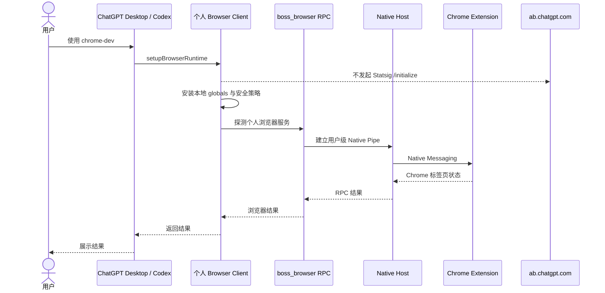

# 个人 Browser Client 远程初始化移除设计

## 问题与证据

`chrome-dev` 个人插件的 Browser Client 在本地运行时建立 Chrome/Native Host 通信前，会执行恢复 bundle 中的遥测启动函数。该函数创建 Statsig 客户端并调用 `initializeAsync()`，其 API 根地址为 `https://ab.chatgpt.com/v1`，因此产生 `/initialize?k=client-…` POST。相同启动区块还初始化 Sentry，并读取 `https://chatgpt.com/backend-api/aura/identity`。

代码调用关系已经直接确认：`setupBrowserRuntime` 调用遥测启动函数；Chrome 连接随后通过个人插件的 `boss_browser` RPC、Native Pipe 和 `com.openai.codexextension.dev` 建立。Statsig 初始化结果没有参与扩展发现、Native Host 注册、浏览器 RPC、插件信任或 `NODE_REPL_TRUSTED_BROWSER_CLIENT_SHA256S` 校验。因此远程请求失败是遥测初始化失败，不是 Chrome 连接失败，也不是个人插件信任失败。

截图中的 `[1:404-1:410]: Illegal return statement` 是提交给 REPL 的 JavaScript 语法错误，和 Statsig 请求属于两个独立错误。

## 目标和边界

- 个人插件初始化期间不请求 `ab.chatgpt.com`、ChatGPT 身份接口或该 bundle 的 Sentry 项目。
- 保留 `setupBrowserRuntime` 的导出、全局对象、`boss_browser` RPC、Chrome Extension、Native Host、站点策略和文件传输安全校验。
- 保留既有信任配置和 `NODE_REPL_TRUSTED_BROWSER_CLIENT_SHA256S`；本次修改不借环境变量伪造、覆盖或放宽信任。
- 不尝试删除整个内联 Statsig SDK。SDK 属于历史恢复 bundle 的第三方代码，停止第一方启动入口即可使它不可达，避免大范围反向拆包。

## 最小方案

把恢复 bundle 中四个被下游调用的遥测接口替换为显式本地空实现：启动、后端标记、用户读取和事件记录。这样既删除远程初始化及身份请求，又维持下游函数调用形状，避免改动浏览器命令实现。

不采用以下方案：

- 捕获或隐藏网络错误：仍会发起请求，不能满足“删除远程初始化”。
- 把地址改成 `127.0.0.1`：仍保留无意义初始化和超时路径。
- 通过环境变量关闭：该个人插件不需要远程 ChatGPT 初始化，增加开关会引入错误配置和回退风险。
- 修改 Native Host 或信任变量：它们不在这条调用链中。

## 初始化时序

## 版本、安装和回滚

修改后的本地候选版本使用 `26.707.30751-standalone.10`，避免覆盖已公开且不可变的 `.9`。构建前保存 `.9` 的 Browser Client、Browser Service 和权威恢复源快照及 SHA-256。部署采用现有原子脚本；用户级安装沿用现有 marketplace、插件缓存和 Native Host reconciliation，不改官方插件身份或企业策略。

回滚时恢复 `.9` 插件版本，或使用本次快照重建 `.9` 生成物。回滚不删除其他信任记录。

## 测试和验收

1. Bun 类型检查、单元测试、可重复构建及现有差分验证通过。
2. 构建验证明确拒绝个人运行时中出现 `https://ab.chatgpt.com`、ChatGPT identity URL 和该 Sentry DSN。
3. 隔离运行时快照记录所有 privileged fetch；候选初始化必须为零请求。
4. `boss_browser` RPC 仍被调用，导出、全局对象和显示接口与 `.9` 基线一致。
5. 重复部署与已部署校验通过；临时用户目录安装/回滚测试保持通过。
6. 本机安装后只做列出标签页等只读验证，不关闭 Chrome 或 ChatGPT Desktop。

## 设计评审

| 检查项 | 结论 | 理由 |
| --- | --- | --- |
| 是否解决实际根因 | 通过 | 直接移除产生远程请求的 `initializeAsync()` 启动链。 |
| 是否误改个人身份或信任 | 通过 | 不修改扩展 ID、Host 名称、代码签名或旧 SHA 信任列表。 |
| 是否保留通信协议 | 通过 | 浏览器 RPC、Native Pipe 和命令处理均在遥测区块之后且不依赖其结果。 |
| 是否需要修改 Native Host | 通过：不需要 | Native Host 不创建该 HTTP 请求。 |
| 是否引入新环境变量 | 通过：不引入 | 没有必要的运行时选择项。 |
| 是否可测试和回滚 | 通过 | 有端点扫描、fetch 陷阱、现有差分验证和唯一快照。 |
| 是否过度设计 | 通过 | 仅保留四个兼容空接口，不重构整个恢复 bundle。 |

## 尚未证明

- 在 ChatGPT Desktop 完整重启后的真实 UI 是否不再显示历史缓存日志，需安装后由用户决定何时重启验证。
- 截图中的 REPL `Illegal return statement` 的具体提交源码尚未提供，本次不处理该独立语法错误。
