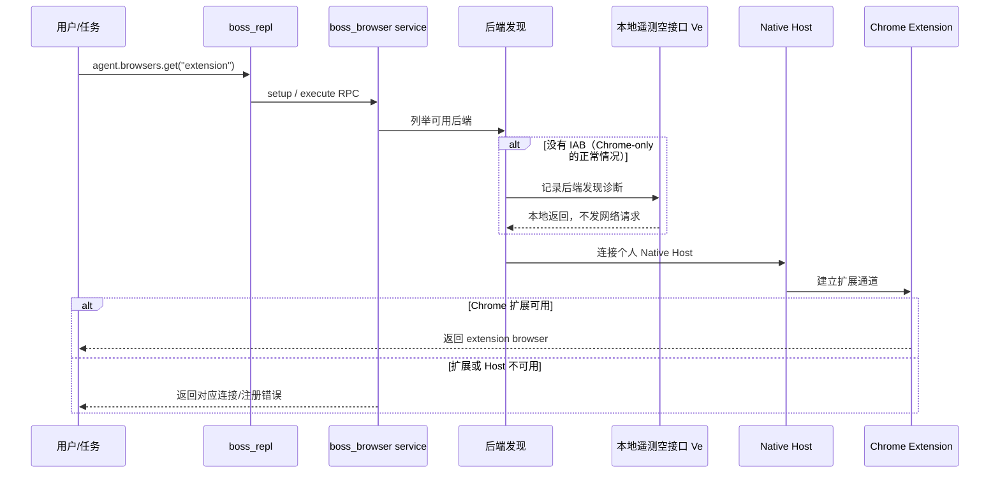

# Browser Service 未定义遥测符号修复设计

## 问题与证据

`26.707.30751-standalone.11` 的个人 `boss_repl` 服务可以启动并响应 `ping`，但在 Chrome-only 模式执行 `agent.browsers.get("extension")` 时失败：

```text
BOSS_BROWSER_SERVICE_UNAVAILABLE: Error: zd is not defined
```

这是已确认的运行时缺陷。远程初始化删除改动把 Browser Client 的统一遥测接口 `Ve` 改成了本地空实现，同时删除了底层 Statsig 变量 `zd`；后端发现失败函数 `AV` 仍有一处绕过 `Ve`、直接调用 `zd` 的遗留代码。浏览器发现会在没有 IAB 后端时执行 `AV`，即使可用后端被明确限制为 `chrome`，因此真实的扩展获取路径会抛出 `ReferenceError`。现有 `--probe` 只执行 `ping`，没有覆盖这个分支。

该错误与插件信任指纹、`NODE_REPL_TRUSTED_BROWSER_CLIENT_SHA256S`、Native Host 注册和 Chrome 扩展 ID 无关。加入旧 Browser Client SHA 不能恢复缺失的 JavaScript 绑定，也会错误地重新启用已淘汰的信任路径。

## 目标与兼容性

- 保持 Statsig、ChatGPT identity 和 Sentry 远程初始化不可达。
- 让后端发现诊断统一经过现有 `Ve` 接口；个人插件中该接口为本地空实现。
- 保持 `boss_browser` RPC、Chrome Extension、Native Host、个人插件身份和 `latest` 启动器不变。
- 增加会真正执行 Chrome 后端发现的动态测试，避免仅凭 `ping` 误判服务可用。
- 版本升级继续使用用户级 marketplace 安装流程，不修改旧 SHA 信任变量。

## 最小方案

将权威运行时源码中 `AV` 的 `zd(...)` 改为 `Ve(...)`。这恢复了原有的遥测抽象边界：上游构建可继续使用统一上报入口，个人插件构建则由 `Ve = () => {}` 明确禁用远程事件。无需恢复 Statsig 客户端、引入新环境变量、增加后台服务或改变错误包装。

备选方案是在删除区块后声明 `zd = () => {}`。该方案依赖压缩变量名，会掩盖其他意外的直接调用，因此不采用。恢复 `zd` 原实现会重新引入远程 Statsig 初始化，也不采用。

## 初始化与验证流程



回归测试必须先以 `.11` 复现 `zd is not defined`，再对候选产物运行相同调用。构建验证同时检查 Browser Client 和 Browser Service 不包含被禁用的远程端点，并确认后端发现函数不再引用未声明的 `zd`。用户级升级后用实际 `launch-browser-service.mjs` 执行相同调用；只允许读取浏览器列表或文档，不访问 BOSS 页面、不发送消息、不上传文件。

## 部署、回滚与评审

部署前把会被覆盖的 `.11` Browser Client、Browser Service 和权威生成运行时保存到唯一的 `scripts-bak/snapshots/standalone.11-zd-undefined-prechange/` 快照，并更新不可变备份清单。失败时可恢复该快照并重新安装 `.11`；用户配置、Native Host 注册和信任记录无需回滚。

| 评审项 | 结论 | 理由 |
| --- | --- | --- |
| 是否解决实际根因 | 通过 | 修复真实执行分支中的未声明符号，而非隐藏服务错误。 |
| 是否需要身份迁移或旧 SHA | 通过 | 当前已是用户级个人插件；本缺陷不涉及信任。 |
| 是否保留协议与官方配置 | 通过 | 仅改变内部诊断调用，RPC、扩展 ID、Host 名称和官方插件不变。 |
| 是否继续禁止远程初始化 | 通过 | `Ve` 仍为空实现，三个远程端点继续受构建检查。 |
| 是否会覆盖其他配置 | 通过 | 不写用户 TOML、企业策略或其他插件记录。 |
| 是否过度设计 | 通过 | 一处运行时调用、一条动态回归路径和一次版本升级。 |
| 是否可测试和回滚 | 通过 | 有 `.11` 基线复现、隔离候选验证、用户级服务验证和唯一快照。 |

评审结论：通过，可以实施。尚未验证的事项只有修复后当前 Desktop 任务是否会自动刷新已启动的 `.11` 服务进程；如果它仍复用旧进程，需要用户完整重启 Desktop 后在新任务中复测。

## 实施与验证结果

实现已按评审方案完成并发布为 `26.707.30751-standalone.12`。权威运行时和两个生成物中的后端发现分支均改为调用 `Ve`；构建验证会实际执行 `agent.browsers.get("extension")`，并拒绝重新出现的 `zd` 调用。

基线 `.11` 通过真实 `launch-browser-service.mjs` 稳定复现 `zd is not defined`。候选产物和最终用户安装态用相同 harness 验证成功：MCP initialize 成功，`agent.browsers.get("extension")` 返回 `Chrome / extension`，`browser.documentation()` 返回 40,862 字节文档，`agent.browsers.list()` 返回 1 个 Chrome extension backend，stderr 为空。验证只读取浏览器服务元数据和文档，没有访问 BOSS 页面、发送消息或上传文件。

本机用户级插件已经升级到 `.12`，`latest` 和用户级 Native Host manifest 均指向该版本。reconcile 前后 `~/.codex/config.toml` 的 SHA-256 相同，说明此次修复未修改用户信任配置。当前任务是否刷新 Desktop 已缓存的 MCP 工具目录仍未验证；若当前任务继续显示 `.11` 错误，需要完整退出并重启 ChatGPT Desktop 后创建新任务复测。
