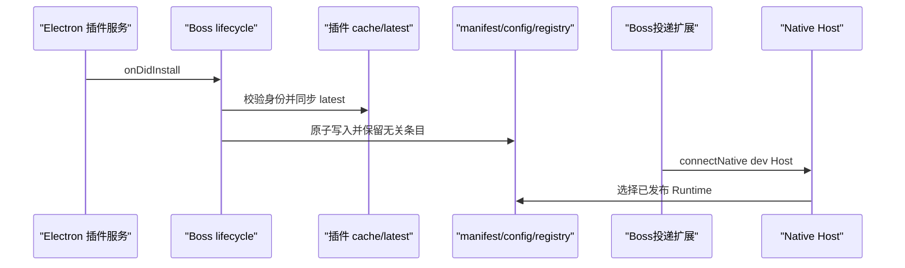

# Boss投递开发过程与复线指南

本文记录 Boss投递从历史故障任务、资源归档、独立插件工程，到 Native Host 安装生命周期和可重复交付的完整工程过程。它的目标不是写一篇事后故事，而是让下一位开发者可以沿相同证据重放关键判断、构建和验证。

## 1. 证据范围

本文使用三类标记：

- **事实**：可以由提交、源码、构建产物、测试或保留日志直接验证。
- **推断**：根据逆向分析、符号、协议和行为作出的语义恢复，不能称为官方源码。
- **残余**：当前仍需真实 Chrome、用户登录态或宿主集成才能验收的部分。

主要证据入口：

| 证据 | 位置 | 能证明什么 |
| --- | --- | --- |
| 来源映射 | `docs/SOURCE-PROVENANCE.md` | develop 中各组件来自哪里、属于源码还是基线 |
| 构建矩阵 | `BUILD-MATRIX.md` | 三种构建档位及其产物边界 |
| 历史任务交付 | 上级 `deliverables/task-019fa2d1-cf87-76f2-8a83-334ccc494ed7/` | 2026-07-27 的 30 秒停顿、重试风暴、补丁和回滚材料 |
| Round 01 | `docs/planning/round-01-native-host-install-lifecycle.md` | Native Host 安装问题、设计、实现和 live 验证 |
| Round 02 | `docs/planning/round-02-manual-install-guide.md` | 手动安装 CLI 与使用说明的范围和验收 |
| Git 提交 | `0bdb0e8`、`3bd6340`、`0d19d01` | 当前 develop 工程的三次可复查演进 |

用户提供的截图补充了三个运行观察：Chrome 已显示“Boss投递已开始调试此浏览器”；Codex 任务能连接 Chrome、读取 BOSS 岗位和聊天页面并在发送前停下；Codex 的定时任务界面可以承载 BOSS 工作流。截图含真实账号和招聘信息，因此不提交到公开仓库。

用户提供的 Notion「Boss」链接当前无法在未认证环境中读取，也没有公开搜索结果。本文不会把 Notion 正文当作已核验来源；待授权 Notion 访问后，可按本文时间线逐条补充产品决策和会议记录。

## 2. 一条线看完整过程


## 3. 阶段一：从历史故障任务获得可复用证据

### 问题

任务 `019fa2d1-cf87-76f2-8a83-334ccc494ed7` 观察到 BOSS 等 busy 页面上的浏览器命令固定等待约 30 秒，内核重置后还会出现永久挂起和高频 RPC 重试。

### 处理方式

历史交付对浏览器客户端和扩展 Service Worker 双侧插桩，保留 pristine 备份、修复后模块、日志节选和回滚说明。日志把问题拆成两条：

1. URL 安全检查链中的远程状态请求产生固定等待；
2. 调试器已经脱离，但扩展仍沿假附加状态重试，形成 `Debugger is not attached` 风暴。

### 结果与边界

交付记录显示，修复后的 evaluate 降至毫秒级、点击加列表读取降至秒级。这个任务提供了诊断方法和补丁证据，但其中关闭安全检查的本地测试补丁不能直接作为生产设计。当前工程保留 `chrome-plugin-debug`、`chrome-plugin-fix-delivery` 和 `chrome-plugin-hang-fix`，让诊断、部署和回滚成为独立技能，而不是散落在一次会话中。

## 4. 阶段二：把资源归档和开发工程分开

### 判断

原材料同时包含历史交付包、已编译扩展、已签名 Host、Rust 语义重建源码、Codex 插件模板和多个技能。如果直接在归档目录中开发，会混淆“可编辑源码”“不可等价重建的基线”和“可以删除重建的产物”。

### 设计

上级 `boss-agent-work/` 保留 `projects/`、`references/`、`deliverables/`、`skills/` 和校验清单；真正的工程统一进入 `develop/`：

```text
develop/
├── components/   可编辑源码和插件模板
├── baselines/    已编译、已签名基线
├── config/       唯一身份配置
├── scripts/      构建、组装、验证、打包
├── docs/         设计、来源、安装和复线
├── dist/         可再生输出
└── artifacts/    可分发压缩包
```

### 实现与验收

提交 `0bdb0e8` 建立工程、Makefile、来源说明、三类核心组件、Codex 插件、7 个技能以及初始验证脚本。`make clean` 可以删除 `dist/` 和 `artifacts/`，但不会碰 `components/` 与 `baselines/`。

## 5. 阶段三：为 Boss投递建立独立身份

### 问题

原始 REST/Chrome 连接器和插件使用既有协议与注册名。若直接复制，Chrome 扩展、Native Host、Codex marketplace 和官方 Chrome 集成会争用同一身份，造成 manifest 覆盖、Host 误选或升级相互污染。

### 身份矩阵

`config/identity.json` 是当前事实源：

| 层 | Boss投递身份 |
| --- | --- |
| 产品显示名 | `Boss投递` |
| Marketplace | `codex-chrome-automation-local` |
| Codex 插件 | `chrome-dev` |
| 插件版本 | `26.707.30751-standalone.4` |
| Chrome 扩展 ID | `jigmpnbdhhempldjgegphdgkochgpagi` |
| Native Host | `com.openai.codexextension.dev` |

扩展通过 manifest 中稳定的 public key 固定 ID；Native Messaging manifest 的 `allowed_origins` 只允许该扩展；Electron lifecycle 只接收上述 marketplace/plugin 组合。官方 `com.openai.codexextension` 不在写入或清理范围内。

## 6. 阶段四：恢复可开发组件并建立构建矩阵

### Chrome 扩展

`components/chrome-extension/` 是 TypeScript + React 的语义重建工程，包含 MV3 Service Worker、Native Messaging transport、JSON-RPC 路由、CDP 会话管理、内容脚本和 Popup。它可以构建，但不能描述为 OpenAI 官方源码的字节级恢复。

### Native Host

`components/native-host/` 根据二进制符号、字符串、扩展消息和行为证据恢复 Rust 控制流，覆盖 Native Messaging framing、JSON-RPC、Runtime 路由、Unix socket、文件资产与授权边界。它属于**推断**；生产安装默认仍使用 `baselines/native-host/` 中已签名 arm64 Host。

### Codex 插件与技能

`components/codex-plugin/` 提供 `.codex-plugin/plugin.json`、浏览器客户端、安装/检查脚本、文档和 `boss-delivery` 路由技能。`components/skills/` 另保留 BOSS 采集、回复、打招呼与 Chrome 调试技能。

### 为什么需要三档构建

| 档位 | 扩展 | Host | 目的 |
| --- | --- | --- | --- |
| `baseline` | 已验证编译基线 | 已签名基线 | 安装、回归、交付 |
| `extension-dev` | 当前 TS/React 源码 | 已签名基线 | 开发扩展并缩小变量 |
| `full-reconstructed` | 当前 TS/React 源码 | Rust 重建产物 | 协议研究，不用于生产 |

这种拆分避免把“源码能编译”误判成“签名、协议和生产兼容性已经等价”。

## 7. 阶段五：定位 Native Host 连接失败

### 现场事实

Round 01 检查到：Boss投递 dev manifest 缺失；`chrome-dev/latest` 指向不存在的旧版本；共享和 `CODEX_HOME` 的 schema-v2 Runtime registry 均没有 Boss投递 entry。Chrome 扩展本身无法写用户文件系统，所以在 `chrome.runtime.onInstalled` 中修复不成立。

### 设计判断

初始化责任放到 Electron Main：



应用启动后再次 reconcile，用同一逻辑自愈漏掉的安装事件和悬空链接。没有新增 Renderer 安装向导：后台幂等操作、结构化错误和既有状态页已经足够，额外 UI 属于过度设计。

### 实现

提交 `3bd6340` 增加：

- `BossPluginNativeHostLifecycle`：安装事件过滤、串行 reconcile 和 ready 自愈；
- `installManifest.mjs`：Chrome/Chromium manifests、Host config 和两份 schema-v2 registry 的原子发布；
- `latest` 安全同步：软链替换、普通目录先备份；
- Electron 独立构建物、测试和交互时序文档。

### 验收

隔离 HOME/CODEX_HOME 测试覆盖悬空链接、幂等 upsert、无关 entry 保留、manifest 冲突和身份过滤。真实环境验证进一步确认 manifest 正确、Runtime entry 存在且 Chrome 实际启动目标 Host。只有这些证据成立时才可标记到 `port-connected`；它仍不等于 BOSS 页面业务动作已验收。

## 8. 阶段六：把安装变成可重复操作

### 问题

Electron 宿主还未接入 `onDidInstall` 时，Codex CLI 只会复制插件 cache，用户仍需要安全地执行相同初始化。复制一大段临时 Node 代码不可维护，也难以 dry-run。

### 实现

提交 `0d19d01` 增加薄 CLI `reconcile-native-host.mjs`，复用同一 lifecycle，自动探测 ChatGPT.app/Codex.app Runtime，支持显式路径、`--dry-run` 和 JSON 输出。`docs/manual-install.md` 覆盖构建、marketplace、插件、Host、Chrome、验证、更新和卸载。

### 分层验收

| 层级 | 证据 |
| --- | --- |
| `extension-installed` | Chrome 识别固定 ID 且扩展启用 |
| `manifest-valid` | manifest 名称、路径与 allowed origin 正确 |
| `runtime-published` | v2 registry entry 存在且路径有效 |
| `port-connected` | Popup Connected 或 Chrome 启动正确 Host |
| `browser-action-verified` | 新会话通过 Boss投递完成一次轻量页面读取 |

前一层不能替代后一层。扩展磁盘内容变化后还必须在 `chrome://extensions` reload Service Worker。

## 9. 从零复线当前工程

### A. 复线设计和提交

```bash
cd /Users/dmeck/project/boss-agent-work/develop

git log --oneline --reverse
git show --stat 0bdb0e8
git show --stat 3bd6340
git show --stat 0d19d01
```

按顺序阅读：

1. `docs/SOURCE-PROVENANCE.md` 和 `BUILD-MATRIX.md`；
2. Round 01 规划与 `docs/native-host-install-lifecycle.md`；
3. Round 02 规划与 `docs/manual-install.md`；
4. Electron lifecycle 源码和测试；
5. Chrome/Host 组件 README 与 manifest。

### B. 复线构建

```bash
make setup
make all
make verify
make package
```

预期得到三个 `dist/<profile>/marketplace/`、三个对应的 `electron-app/`，以及 `artifacts/boss-delivery-<profile>.tar.gz` 和 SHA-256 文件。

### C. 复线本机安装

严格执行 `docs/manual-install.md`。推荐先安装 `baseline`，完成一次只读岗位页面检查，再切换 `extension-dev` 验证源码修改。不要用 `full-reconstructed` 替代生产签名 Host。

### D. 复线故障

- 连接失败：先运行 manifest、registry 和 `latest` 检查，再看扩展 reload 和 Host 进程。
- 固定 30 秒：使用 `chrome-plugin-debug` / `chrome-plugin-hang-fix`，区分安全检查等待与 debugger 假附加。
- 需要部署修复：使用 `chrome-plugin-fix-delivery` 的检查、备份、部署和回滚流程。

## 10. 当前完成状态与残余

已完成：独立身份、三档构建、Codex 插件结构、Electron 安装生命周期、手动 reconcile、隔离测试、打包和 GitHub 提交。

仍需按环境完成：

- Chrome Web Store 的开发者账号、隐私披露和正式审核；
- Windows/Linux Host 产物与安装器；
- 宿主 Electron 项目对 `registerBossPluginNativeHostLifecycle()` 的正式接线；
- 每个 Chrome/BOSS 版本上的页面级回归；
- 任何批量沟通或投递前的产品级确认、限速和审计策略。

这些残余不是 README 或 manifest 能替代的。它们应以真实环境和真实动作的证据单独验收。
