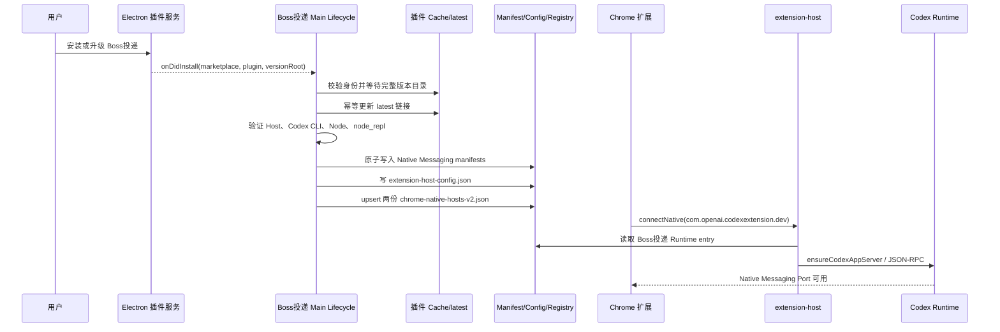
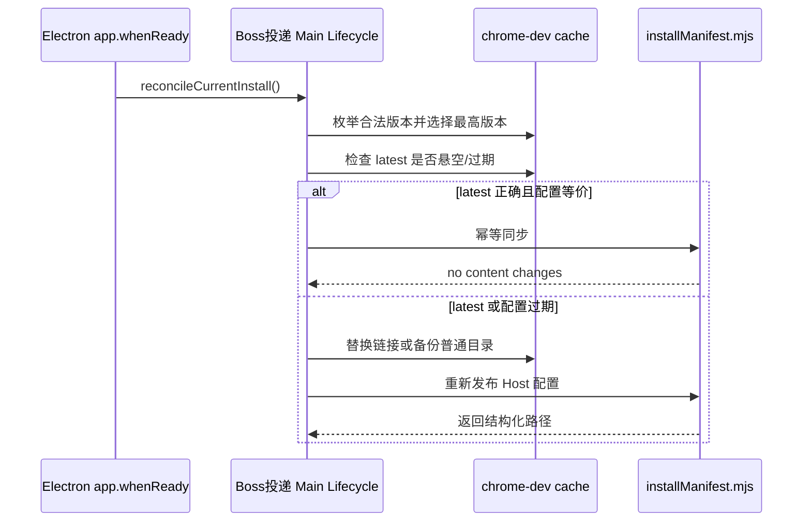

# Boss投递 Native Host 安装交互设计

## 目标与判断

Native Messaging manifest 位于用户目录，Chrome 扩展的 Service Worker 无权创建它。因此默认初始化必须属于 Electron Main 的插件安装生命周期，而不是 `chrome.runtime.onInstalled`。

本设计只增加后台生命周期，不增加安装向导或设置页。成功安装不弹窗；失败写入结构化日志，由现有插件状态和排障脚本展示原因。这样满足“安装即初始化”，同时避免为单个本地注册步骤增加过度 UI。

## 交互状态

| 状态 | 用户可见行为 | Electron Main 行为 |
| --- | --- | --- |
| 插件安装中 | 保持现有安装进度 | 等待 version root 完整落盘 |
| 初始化中 | 无额外弹窗 | 修复 `latest`，验证 Runtime，原子写 manifest/config/registry |
| 初始化成功 | 插件可以正常进入连接重试 | 记录 manifest、registry 和 Host 路径 |
| 初始化失败 | 插件显示 Disconnected | 记录缺失文件或冲突，不留下半写临时文件 |
| 应用重启 | 无操作 | ready 后再次 reconcile，自愈遗漏事件和悬空链接 |

## 业务时序



## 启动自愈时序



## 安全与回滚

- 只处理 marketplace `codex-chrome-automation-local`、插件 `chrome-dev`、Host `com.openai.codexextension.dev`。
- Registry upsert 保留无关 entry；不会改写官方 Host 身份。
- `latest` 若为普通文件或目录，先改名备份，不直接删除。
- 所有文本采用同目录临时文件后 rename；失败不会留下半个 JSON。
- `Connected` 只表示 Native Port 存活；端到端仍需 `ensureCodexAppServer` 或一次真实浏览器动作验证。

## 个人指纹配置与信任边界（2026-09-07）

`NODE_REPL_TRUSTED_BROWSER_CLIENT_SHA256S` 是旧版宿主的共享 Browser Client allowlist，不是个人插件身份，也不是操作系统变量。本项目不追加或覆盖该变量。个人插件通过自己的 `.mcp.json` 启动 `boss_repl`，并只在该子进程注册 `boss_browser` trusted service；启动器删除继承的旧 SHA 变量，官方服务保持不变。

个人插件只读取专用变量 `BOSS_PLUGIN_EXPECTED_BROWSER_CLIENT_SHA256`，作为受审查 Browser Client 文件的预期 SHA-256；默认未设置。优先级为 `--expected-browser-client-sha256` 参数、该环境变量、未指定。它仅用于完整性比较，不能授予宿主信任，也不会被传递为宿主 SHA256S 信任列表。请将经过审查的发行产物哈希保存在自己的终端或运行命令环境中，不要放进宿主的全局 shell_environment_policy。

```bash
BOSS_PLUGIN_EXPECTED_BROWSER_CLIENT_SHA256="<受审查产物的64位SHA-256>" \
  bun components/electron-app/bin/reconcile-native-host.mjs --dry-run --json
bun components/electron-app/bin/reconcile-native-host.mjs --codex-home /absolute/personal-codex --dry-run --json
```

命令逐项报告 `PLUGIN_NOT_INSTALLED`、`PLUGIN_DISABLED`、`PLUGIN_UNTRUSTED`、`FINGERPRINT_MISMATCH`、`USER_CONFIG_ERROR`、`INVALID_ENVIRONMENT`、`CONFIG_CONFLICT`、`POLICY_REVIEW_REQUIRED`、`RUNTIME_INCOMPATIBLE` 或 `RUNTIME_UNVERIFIED`。只有真实 `boss_browser` ping 返回匹配 nonce、服务名、协议版本且受信 worker 可见 `nativePipe` 时，`effectiveTrust` 才为 `isolated-service-authorized`；`recorded` 只是旧 allowlist 诊断。

通过前置检查后，注册会先备份 Native Host 目标至所选 CODEX_HOME/backups/personal-plugin-native-host-*/snapshot.json，再调用原注册器。返回 `nativeHostRegistered` 和 `connectionVerified=false`，不再用笼统的 correct 表示整体就绪。同一次初始化成功后的回滚命令：

```bash
bun components/electron-app/bin/rollback-native-host.mjs /absolute/path/to/snapshot.json
```

回滚前检查文件是否在初始化后被其他进程修改，冲突时拒绝覆盖。注册失败保留原始快照供人工恢复，不自动回滚并发写入。config.toml 始终只读，因此不存在需要恢复的信任配置修改。直接 Electron 生命周期 API 仍仅注册 Native Host；它不是信任安装器，也不代表 Browser Client 连接已验收。

设计、证据与完整限制见 [personal-plugin-trust-design.md](personal-plugin-trust-design.md)。动态服务授权已验证；Desktop 重新加载插件后的真实 Chrome 连接仍要单独验收。
