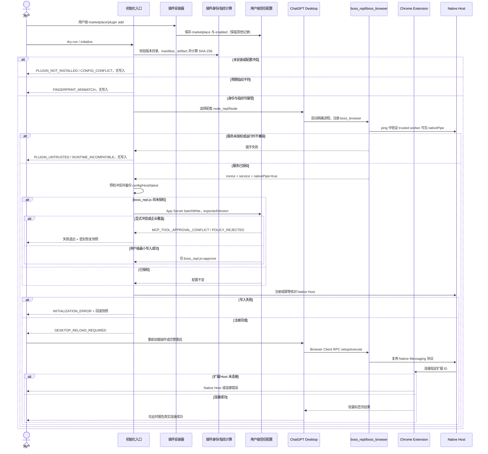

# 个人插件身份与信任配置设计

日期：2026-09-07

工程：`/Users/dmeck/project/boss-agent-work/develop`
分支：`codex/release-package-hygiene`

## 结论与根因

“个人插件占用了系统指纹”这个表述不成立，但用户指出的隔离问题成立。修改前插件已经安装在当前用户的 Codex 缓存中；真正的问题是个人 Browser Client 仍按旧版共享 `node_repl` 的 `nativePipe` 模型启动，而当前 Desktop 运行时只向普通客户端公开 `rpc`。把当前文件哈希加入 `NODE_REPL_TRUSTED_BROWSER_CLIENT_SHA256S` 后，真实导入仍然得到 `nativePipe=false`，因此旧变量不能完成当前初始化。

本次修复使用插件自带的 MCP `boss_repl`，由它启动独立的 `node_repl` 子进程，并仅为该子进程注册插件自己的 `boss_browser` trusted service。Browser Client 通过 `nodeRepl.rpc("boss_browser", ...)` 调用服务；服务内部保留现有 `nativePipe -> Native Host -> Chrome Extension` 通信。启动器主动从子进程环境删除旧 SHA allowlist。初始化器通过 Codex App Server 只为个人插件写入 `boss_repl` 的 `js` 工具授权；官方 `browser`、官方插件、代码签名、历史 SHA 变量和企业策略保持独立。

## 证据状态

| 项目 | 状态与证据 |
| --- | --- |
| 插件身份 | confirmed：`chrome-dev@codex-chrome-automation-local`；修改前版本 `26.707.30751-standalone.4`，本次最终版本 `.8`。名称、marketplace 与版本来自插件 manifest 和用户配置。 |
| 安装作用域 | confirmed：版本目录位于 `~/.codex/plugins/cache/codex-chrome-automation-local/chrome-dev/`，属于当前用户。没有系统级插件安装证据。 |
| Chrome 扩展 ID | confirmed：`jigmpnbdhhempldjgegphdgkochgpagi`。它只标识 Chrome 扩展。 |
| Native Host | confirmed：名称 `com.openai.codexextension.dev`；manifest 与 registry 位于当前用户目录，由 `reconcile-native-host.mjs` / Electron lifecycle 创建。 |
| 指定哈希 | confirmed：`9599a8a...e6e6` 是修改前 `scripts/browser-client.mjs` 的文件 SHA-256。它不是插件 ID、扩展 ID、Host 名称或代码签名。新版 bundle 的哈希会随文件字节变化。 |
| 旧信任变量 | confirmed：`NODE_REPL_TRUSTED_BROWSER_CLIENT_SHA256S` 是旧 Browser Client 文件哈希 allowlist 的进程环境接口；本机值位于 `shell_environment_policy.set`，会传给通用子 shell。它不是 macOS 系统变量，也不是个人插件安装身份。 |
| 旧变量当前效果 | confirmed：当前 `node_repl` 二进制含 `NODE_REPL_TRUSTED_SERVICES`，不含旧 SHA 变量字符串；A/B 实验中设置正确旧哈希仍无法取得 `nativePipe`。 |
| 当前失败点 | confirmed：旧 Browser Client 在调用 Chrome 前因缺少 `nativePipe` 抛错，故不能归咎于 Chrome 扩展连接。 |
| 新授权机制 | confirmed：当前 `node_repl` 对独立 `boss_browser` 服务完成实际 RPC ping；响应由受信 worker 返回 `nativePipeAvailable=true`、随机 nonce、服务名和协议版本。 |
| MCP 工具授权 | confirmed：用户层键 `plugins."chrome-dev@codex-chrome-automation-local".mcp_servers.boss_repl.tools.js.approval_mode` 已设为 `approve`。写入使用 App Server `config/read` 与带 `expectedVersion`、`filePath` 的 `config/batchWrite`，保留无关配置；显式拒绝或托管覆盖不会被替换。 |
| 代码签名 | confirmed：Native Host 可执行文件的签名/哈希检查与 Browser Client 信任是独立边界，本次不伪造或替换签名。 |
| Chrome 连接 | confirmed：新启动的临时 Codex 任务发现 `boss_repl`，完成一次 `browser.tabs.list()`；返回 Chrome backend 且 `tabCount=0`，未导航、点击、输入、上传或提交。 |
| Desktop 缓存 | inferred：当前已运行的 Desktop GUI 仍可能保留安装前工具目录；完整重启后的 GUI 状态尚未验证。 |
| 企业策略 | unresolved：本机未发现的远程策略无法从工程证明。发现常见托管配置时初始化停止并报告 `POLICY_REVIEW_REQUIRED`。 |

## 旧版初始化代码位置

历史重建代码中的链路如下，它只说明旧版如何构造环境：

1. 旧 Browser Client 哈希常量：`/Users/dmeck/project/CodexChromePlug/codex-1.1.5_0/Codex-Electron-Reconstructed-Source-Only-Out/work/strict/reconstructed-project/src/runtime/.vite/build/main-BJ6Uf5yA.ts:482`。
2. 哈希数组传入 Browser Native REPL 配置：同文件约 `1555` 与 `1592` 行。
3. 数组连接为逗号字符串并写入 MCP 环境：`/Users/dmeck/project/CodexChromePlug/codex-1.1.5_0/Codex-Electron-Reconstructed-Source-Only-Out/src/main/browser/browser-native-repl-config.ts:65`（赋值位于 66 行）。
4. 旧版 `node_repl` 的实际校验器二进制/源码不在当前归档中，因此它如何比较哈希仍为 unresolved。当前 Desktop 已经采用 trusted-service 接口。

`shell_environment_policy.set` 与 `mcp_servers.node_repl.env` 是两个不同传递位置。前者是 Codex 子 shell 环境策略，后者才是历史 MCP 启动环境；不能互相当成信任持久化接口。

## 目标、非目标与兼容性

目标是：个人插件独立安装、独立启动服务、动态验证宿主授权；初始化幂等；指纹变化可审查；Native Host 用户级注册；配置更新有备份与冲突保护；现有 Extension/Native Host 协议保持不变。

非目标是：迁移或冒充官方插件；写死某个哈希为永久身份；关闭信任检查；更改企业策略；修改 Native Host 代码签名；把任意环境值追加到共享 allowlist；自动关闭 Chrome 或 Desktop。

## 身份、注册和信任关系

| 对象 | 值/机制 | 持久化位置 |
| --- | --- | --- |
| Marketplace | `codex-chrome-automation-local` | 用户 `config.toml` 的 marketplace 记录 |
| 插件 | `chrome-dev`、版本化目录 | 用户 Codex plugin cache |
| Chrome Extension | `jigmpnbdhhempldjgegphdgkochgpagi` | Chrome 用户配置 |
| Native Host | `com.openai.codexextension.dev` | 用户 NativeMessagingHosts manifest 与 Codex registry |
| MCP 服务端 | `boss_repl` | 插件自带 `.mcp.json`；使用与官方插件相同的 ChatGPT bundled Node 绝对入口，避免 GUI PATH 缺少 Bun |
| trusted service | `boss_browser` | 仅存在于插件启动的子进程 `NODE_REPL_TRUSTED_SERVICES` 中 |
| MCP 工具授权 | 仅 `boss_repl.js = approve` | 用户 `config.toml` 的个人插件命名空间；通过 Codex App Server 结构化写入 |
| 发布完整性 | Browser Client SHA-256 | 运行时计算；可由个人预期变量固定发布摘要 |
| Host 签名 | 平台代码签名/可执行文件校验 | 构建产物和平台注册结果 |

## 方案选择

| 方案 | 评审 | 理由 |
| --- | --- | --- |
| 向旧共享 SHA allowlist 追加当前哈希 | 拒绝 | 当前运行时不使用它；污染通用 shell；文件哈希不是插件身份。 |
| 覆盖官方 `browser` trusted service | 拒绝 | 会与官方 Computer Use 冲突，无法保证升级兼容。 |
| 修改 Native Host 以绕过信任 | 拒绝 | 修错层级并削弱安全边界。 |
| 插件自带 `boss_repl` + `boss_browser` | 通过 | 名称、进程和配置隔离；复用当前服务机制；动态握手可验证；不动既有通信协议。 |

## 环境变量

| 名称 | 用途、默认值与优先级 |
| --- | --- |
| `CODEX_HOME` | 用户配置与插件缓存根。`--codex-home` > 调用进程环境 > `~/.codex`。必须是绝对且非根目录路径。 |
| `BOSS_PLUGIN_EXPECTED_BROWSER_CLIENT_SHA256` | 可选的发布完整性预期。命令行 `--expected-browser-client-sha256` 优先；默认不设；必须为 64 位十六进制。只比较文件，不授予服务权限。 |
| `BOSS_PLUGIN_NODE_REPL_PATH` | 非标准 Desktop 安装时覆盖 `node_repl` 路径；默认自动发现 ChatGPT/Codex app；必须为可访问的绝对路径。 |
| `BOSS_PLUGIN_NODE_PATH` | 非标准 Desktop 安装时覆盖配套 Node；默认从所选 Desktop Resources 推导；必须为可访问的绝对路径。 |
| `NODE_REPL_TRUSTED_SERVICES` | 启动器为自己的子进程构造，只含 `boss_browser -> browser-service.mjs`。不是用户配置项，不继承或合并官方服务。 |
| `NODE_REPL_TRUSTED_BROWSER_CLIENT_SHA256S` | 历史诊断项。启动器从个人子进程删除该值；初始化器不新增、不覆盖、不把它当成授权。 |

## 初始化、升级和漂移

首次安装由受支持的 `codex plugin marketplace add` 与 `codex plugin add` 写入用户级 marketplace/enable 记录。初始化器随后验证版本目录直接属于个人 cache、manifest 身份、`.mcp.json`、三项 runtime artifact、配套 Desktop 可执行文件和用户配置，再启动一次真实服务 ping。全部通过后才备份并写入 Native Host 目标。

重复初始化重新执行相同检查；已有相同注册保持不变。写入前将本轮读取到的 Browser Client 哈希固定为二次预检的 expected 值，可发现检查和写入之间的字节漂移。升级使用新的版本目录；若调用方设置发布预期哈希，任何版本/内容变化都会以 `FINGERPRINT_MISMATCH` 阻止初始化。未设置预期值时，版本身份、artifact 结构和动态授权仍必须通过。

配置冲突、损坏 registry、Host 所有权不一致或托管配置都会在写入前退出。Native Host manifest、registry、Host config、`latest` 与 `config.toml` 先保存同一轮独立快照；回滚仅在目标没有后续第三方修改时恢复。缺少工具授权时，初始化器调用所选 Codex CLI 的 App Server，在用户层以 `expectedVersion` 做并发保护，只 upsert 个人插件的 `boss_repl.js.approval_mode=approve`。已有显式非 `approve` 策略、禁用 server/tool 或 `okOverridden` 企业覆盖均停止，不会被改写。

安装或升级后返回 `DESKTOP_RELOAD_REQUIRED`。不自动关闭 Desktop/Chrome。只有在新会话中完成轻量标签页读取，才能标记真实连接已验证。

## 错误与恢复

- `PLUGIN_NOT_INSTALLED`：用个人 marketplace selector 安装。
- `PLUGIN_DISABLED`：通过 plugin installer 启用该 selector。
- `MCP_TOOL_APPROVAL_REQUIRED`：preflight 提示初始化将只授权个人 `boss_repl.js` 工具。
- `MCP_TOOL_APPROVAL_CONFLICT` / `MCP_TOOL_DISABLED` / `MCP_SERVER_DISABLED`：已有显式用户策略冲突，停止且不覆盖。
- `PLUGIN_UNTRUSTED`：真实 `boss_browser` 授权握手失败；查看所选 Desktop 运行时与 launcher 输出。
- `FINGERPRINT_MISMATCH`：已安装 Browser Client 与审查过的发布摘要不同，停止并审查升级。
- `USER_CONFIG_ERROR`：用户配置不可读或 TOML 无法解析，不写入。
- `INVALID_ENVIRONMENT`：修正 CODEX_HOME、摘要或 runtime path。
- `POLICY_REVIEW_REQUIRED`：发现托管配置，交由宿主/管理员裁决。
- `POLICY_REJECTED`：App Server 确认用户层授权被托管配置覆盖，停止初始化。
- `RUNTIME_INCOMPATIBLE`：所选运行时没有 trusted-service 支持；旧 SHA allowlist 不是 fallback。
- `INITIALIZATION_ERROR` / `CONFIG_CONFLICT`：保留密封快照，按输出路径恢复本轮配置和 Host 目标。
- `DESKTOP_RELOAD_REQUIRED`：重新加载插件或完整重启后再做只读连接验证。

## 初始化与信任时序

## 设计评审

| 检查项 | 结论 | 理由 |
| --- | --- | --- |
| 解决实际根因 | 通过 | 客户端改为当前服务式 RPC，并由动态握手验证，不再隐藏旧 nativePipe 错误。 |
| 避免无意义身份迁移 | 通过 | 保留现有用户级 selector、扩展 ID 与 Host 名称。 |
| 保留官方身份和协议 | 通过 | 独立 `boss_*` 命名；官方服务、签名与 Extension/Host wire protocol 不变。 |
| 使用受支持机制 | 通过 | 插件自带 MCP manifest，使用当前 `NODE_REPL_TRUSTED_SERVICES` 合约。 |
| 配置安全 | 通过 | App Server 只 upsert 个人插件工具授权，使用用户层版本条件；config 与 Host 目标先备份，显式冲突和企业覆盖退出。 |
| 是否修改 Native Host | 通过，无需修改 | Host 通信能力可复用，根因在 Browser Client 启动边界。 |
| 控制复杂度 | 通过 | 新增一个服务 handler、一个 launcher 和一个 MCP manifest，无后台常驻服务或全局重构。 |
| 指纹漂移 | 通过 | 每次计算、写入前二次固定，支持显式发布摘要；不把摘要当永久身份。 |
| 可测试/回滚 | 通过 | 单元、真实 handshake、临时用户目录幂等/回滚和打包验证均有独立入口。 |

## 验收与回滚

验收覆盖：Bun 类型检查/单测/构建；client→service RPC；真实 node_repl trusted-service ping；临时 CODEX_HOME 首次与重复初始化；保留其他 registry 和 config；Native Host 测试；三种发行 profile；安装后 dry-run；最终只读标签页读取。

`scripts-bak` 保留原始基线，并新增本轮修改生成物前的唯一快照；当前清单 digest 为 `d5537ab072c6cfd1a64d69aec27a3a76dd7b6a0f30eb9925d4d1e42f8b1cdd38`（345 文件）。`bun run rollback` 会恢复原树；用户级配置与 Host 回滚使用初始化输出的 snapshot 文件。

尚不能证明的事项：完整重启后当前 Desktop GUI 是否即时刷新工具目录；Windows HKCU 回滚的完整性；未出现在本机文件中的远程企业策略。新启动的临时 Codex 任务已经发现工具并完成真实 Chrome 标签页只读调用。
