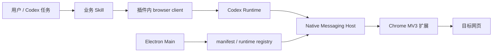

# 开发类似 Codex Chrome 自动化插件

本文把 Boss投递中的可复用工程决策抽成一套最小指南，适合开发一个拥有独立 Chrome 扩展、Native Messaging Host、Codex 插件和业务技能的本地自动化插件。

## 1. 先定义产品和安全边界

开始写代码前，先写清楚：

1. 自动化对象和允许访问的站点；
2. 默认只读动作与会产生外部影响的动作；
3. 哪些动作必须由用户明确确认；
4. 是否依赖用户当前 Chrome 登录态；
5. 支持的平台、CPU 架构和浏览器；
6. 数据是否落盘、保存多久、如何删除。

对招聘、邮件、支付和发布内容等工作流，“打开详情”和“发送/提交”必须是不同的权限层。定时任务也不能绕过确认、限速和审计边界。

## 2. 建立不可冲突的身份矩阵

为每个新插件创建自己的配置事实源，不要复制 Boss投递或官方 Chrome 集成的身份：

```json
{
  "productName": "Your Product",
  "marketplaceName": "your-marketplace",
  "pluginName": "your-plugin",
  "pluginVersion": "0.1.0",
  "extensionVersion": "0.1.0",
  "extensionId": "由专用 manifest key 推导",
  "nativeHostName": "com.yourcompany.yourplugin"
}
```

至少校验四个等式：

- manifest public key 推导出的 ID 等于配置中的 extension ID；
- 扩展 `connectNative()` 使用配置中的 Host 名称；
- Native Messaging manifest 的 `allowed_origins` 只包含目标 extension ID；
- Electron 安装事件只接受目标 marketplace/plugin 身份。

## 3. 使用标准 Codex 插件结构

最小本地 marketplace：

```text
marketplace/
├── .agents/plugins/marketplace.json
└── plugins/your-plugin/
    ├── .codex-plugin/plugin.json
    ├── skills/
    │   └── your-skill/SKILL.md
    ├── scripts/
    ├── chrome-extension/
    └── extension-host/
```

`.codex-plugin/plugin.json` 是必需文件。插件元数据至少应包含 name、version、description、skills 和 interface；marketplace entry 应显式声明 installation、authentication policy 和 category。本地 marketplace 不会自动出现，安装前必须先注册：

```bash
codex plugin marketplace add /absolute/path/to/marketplace --json
codex plugin add your-plugin@your-marketplace --json
```

开发版更新应提升版本或使用明确的 cache 更新流程。不要依赖覆盖 `latest` 下文件让所有运行中的 Service Worker 自动刷新。

## 4. 分离五个运行责任



| 组件 | 应负责 | 不应负责 |
| --- | --- | --- |
| Skill | 业务策略、确认、进度、恢复 | 直接写系统注册文件 |
| browser client | 稳定 API、会话和错误归一化 | 偷偷切换到另一套浏览器工具 |
| Chrome 扩展 | 页面、CDP、内容脚本、Native Port | 写用户 NativeMessagingHosts |
| Native Host | stdio framing、Runtime 路由、进程桥接 | 承担产品 UI |
| Electron Main | 安装事件、文件系统注册、启动自愈 | 在 Renderer 暴露不必要的系统写权限 |

## 5. 设计 Native Messaging 协议

Native Host manifest 的核心结构如下：

```json
{
  "name": "com.yourcompany.yourplugin",
  "description": "Your plugin native host",
  "path": "/absolute/path/to/extension-host",
  "type": "stdio",
  "allowed_origins": [
    "chrome-extension://your_extension_id/"
  ]
}
```

实现时需要同时处理：

- stdin/stdout 的 4 字节小端长度前缀；
- 请求、响应、通知和错误的 JSON-RPC 关联；
- Host 崩溃、Chrome reload、端口断开和指数退避；
- 消息大小、路径、origin 和 peer 身份边界；
- Runtime 多实例选择与失效 entry 清理。

不要把“manifest JSON 存在”当作协议已成功。至少还要证明 Chrome 启动了目标 Host，并完成一次低风险业务调用。

## 6. 把安装做成幂等生命周期

插件安装完成和 Electron app ready 应调用同一个 reconcile：

```text
校验 marketplace/plugin/version root
  -> 同步 latest
  -> 验证 Host 与 Runtime 文件
  -> 原子写 Native Messaging manifests
  -> 写 Host config
  -> upsert Runtime registry
  -> 返回结构化结果
```

最低安全要求：

- 只修改自己拥有的 Host、extension ID 和 registry entry；
- 保留其他插件与官方 entry；
- JSON 在同目录写临时文件后 rename；
- `latest` 是普通目录时先备份，不递归删除；
- 冲突 manifest 指向其他产品时停止，不覆盖；
- 支持 dry-run、JSON 输出和显式 Runtime 路径。

Boss投递的参考实现位于 `components/electron-app/`，交互说明见 `docs/native-host-install-lifecycle.md`。

## 7. 建立源码、基线和产物边界

如果部分组件只能逆向或语义恢复，使用三层目录：

```text
components/   可编辑、可审查的源码
baselines/    已签名或无法等价重建的二进制基线
dist/         构建生成，可安全清理
```

产物写入 provenance 文件，记录当前 profile 使用了哪一份扩展和 Host。推荐至少提供：

- baseline：最稳定回归；
- extension-dev：只替换扩展，保持 Host 不变；
- full-reconstructed：全部源码构建，只用于研究或明确标注的测试。

这样一次只改变一个变量，也避免把未签名重建 Host 误发到生产。

## 8. 业务 Skill 的设计

一个业务 Skill 应包含：

- 明确触发范围和浏览器依赖；
- 连接失败时的停止条件；
- 页面选择器与站点版本风险；
- 读取、筛选、草拟、确认、发送的分层；
- 批处理进度、限速、去重和恢复点；
- 数据 schema 与最小保存原则；
- 故障时不切换到未授权工具的规则。

对于 BOSS 类流程，推荐把采集、回复和主动沟通拆成不同技能。这样只读采集不会自然升级为外部发送，定时任务也能选择最小权限入口。

## 9. 测试矩阵

### 静态门禁

- 插件 manifest schema 和资源路径；
- extension ID、Host 名称和 allowed origin 一致性；
- skill frontmatter 和引用文件存在；
- 构建物中 Host 可执行、CLI 可执行；
- provenance 与 profile 一致。

### 隔离测试

在临时 HOME/CODEX_HOME 中覆盖：

- 首次安装与重复安装；
- `latest` 缺失、悬空、旧版本和普通目录；
- registry 为空、已有无关 entry、已有同 identity entry；
- manifest 冲突；
- 非目标安装事件被忽略；
- Runtime 缺文件时拒绝半套写入。

### Live 门禁

依次验收：

```text
extension-installed
  -> manifest-valid
  -> runtime-published
  -> port-connected
  -> browser-action-verified
```

浏览器动作优先选择标题、URL 或列表条数等只读检查。提交表单、发送消息、投递简历等动作必须另设确认用例。

## 10. 常见失败模式

| 现象 | 优先检查 |
| --- | --- |
| 插件显示 Disconnected | manifest 路径、allowed origin、Host 权限和架构 |
| manifest 正确但没有进程 | 扩展是否 reload、Service Worker 日志、connectNative 重试 |
| Host 启动后立刻退出 | framing、stdout 污染、Runtime 路径、签名/权限 |
| `latest` 指向旧版 | 安装事件是否触发、启动 reconcile 是否接线 |
| 每条命令固定等待 | 网络安全检查、遥测/状态接口超时、审批链 |
| 高频 `Debugger is not attached` | 调试器实际状态与内部 session 状态不一致 |
| 本地修改升级后消失 | 插件 cache 版本更新覆盖；应版本化、重建和重新安装 |

## 11. 发布前清单

- [ ] 产品、marketplace、plugin、extension、Host 身份全部唯一。
- [ ] `.codex-plugin/plugin.json` 与 marketplace manifest 验证通过。
- [ ] Chrome 权限符合最小权限原则，隐私披露与实际行为一致。
- [ ] Native Host 有目标平台/架构产物并完成签名策略。
- [ ] Electron 安装、启动自愈、dry-run、升级和卸载均有测试。
- [ ] 批量外部动作具备确认、限速、去重、恢复和审计。
- [ ] 所有 profile 可构建，压缩包有 SHA-256 和 provenance。
- [ ] 在全新 Chrome profile 和全新 Codex 数据目录完成端到端验收。

Boss投递当前工程可以作为上述结构的实例，但新插件必须生成自己的身份、权限和安全策略，不能只改显示名称后复制发布。
