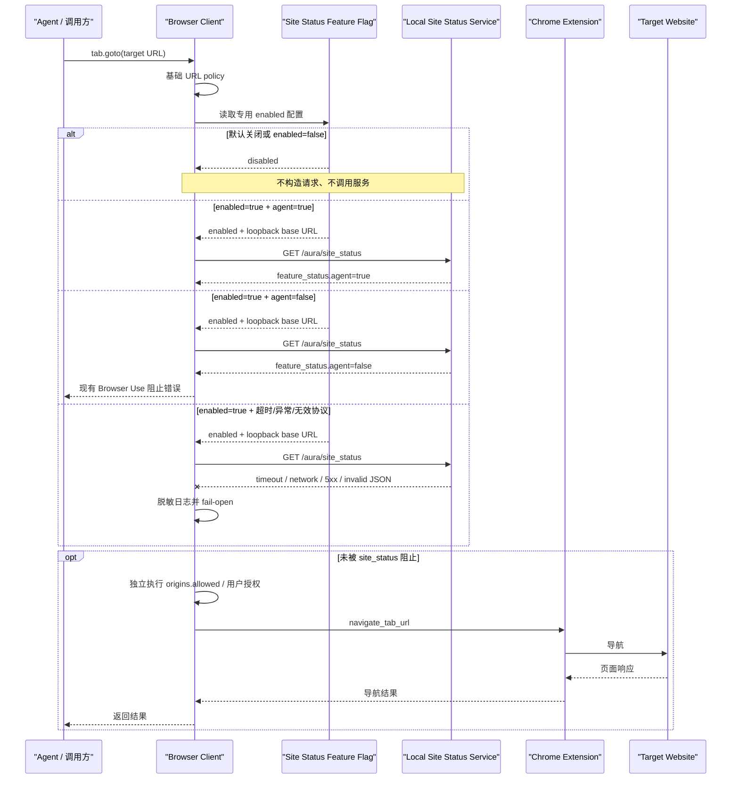

# 浏览器 Site Status 本地服务设计

## 1. 背景与根因

Boss投递当前随包提供的 `browser-client.mjs` 在执行 `tab.goto()` 前进入浏览器安全链：

```text
tab.goto()
  -> executeAgentCommand()
  -> security.ensureCommandAllowed()
  -> ensureTargetUrlOriginAllowed()
  -> ensureUrlPolicyAllowed()
  -> throwIfBlocksUrl()
  -> nodeRepl.fetch(GET https://chatgpt.com/backend-api/aura/site_status)
```

目标站返回“Chrome is not permitted”并非本地 `origins.allowed` 直接产生。它来自远程 `site_status` 响应或缺失字段被解析为 blocked。国内或受限网络还可能让每条命令等待约 30 秒；网络异常最终会被捕获并放行，但失败不会形成有效缓存。

实际代码位于 `components/codex-plugin/scripts/browser-client.mjs`：

- 硬编码基址：bundle 内的 `https://chatgpt.com/backend-api` 常量。
- 请求构造：把目标 URL、source、conversation ID 和 turn ID写入 `/aura/site_status` query。
- 响应解析：只有 `feature_status.agent === true` 返回允许；其他结构返回 blocked。
- 调用位置：`ensureUrlPolicyAllowed()` 先执行基础 URL policy，再调用 site status。
- 后续授权：`ensureTargetUrlOriginAllowed()` 在 URL policy 后继续 degraded-site 与 origin consent。
- 默认模式：`BROWSER_USE_SECURITY_MODE` 未设置时，各项安全检查正常启用；只有旧的 `disabled-for-local-testing` 模式会通过 `check-url-site-status` 跳过此检查，同时也跳过多项其他授权，因此不能用于本次修复。

搜索 Boss 工作区、原始 Codex Home、Round 52 参考和 Electron 语义恢复工程后，只找到同一 bundle 的复制品，没有生成它的原始 TypeScript/JavaScript 源码。Chrome 扩展的 TypeScript 工程只生成扩展 Service Worker，不生成 browser client。因此本轮采用独立可测试源码加确定性 bundle 适配脚本；不把插件 cache 当作长期源文件。

## 2. 目标

- `site_status` 默认关闭，禁用时不发起任何请求。
- 显式启用后只访问 loopback 本地服务，不回退 ChatGPT 域名。
- 保持请求参数和 `feature_status.agent` 核心协议兼容。
- `agent === false` 使用现有 Browser Use 阻止错误。
- 本地服务运行异常或协议无效时 fail-open，并输出脱敏诊断。
- 保留基础 URL 校验、origin 授权、文件传输授权、raw CDP 授权和其他安全机制。
- 实现可单测、可重新组装、可检测上游 bundle 漂移。

## 3. 非目标

- 不实现本地 site status 服务或管理 UI。
- 不引入远程配置中心、服务发现、消息队列或数据库。
- 不增加自动重试、熔断器或多层策略插件系统。
- 不重构整个 browser security subsystem。
- 不修改 Chrome 扩展、Native Host 协议或 BOSS 页面逻辑。
- 不使用 `disabled-for-local-testing` 作为默认值。

## 4. 当前流程与职责差异

| 机制 | 目的 | 数据来源 | 本轮处理 |
| --- | --- | --- | --- |
| 基础 URL policy | 拒绝非 HTTP(S) 等不合法导航 | browser client 内置规则 | 保持不变 |
| `site_status` | 服务端站点级 agent allow/block | 当前为 ChatGPT API | 改为默认关闭、可选本地服务 |
| `origins.allowed` | 用户/会话是否授权访问具体 origin | `browser/config.toml` 与 elicitation | 保持独立、继续执行 |
| 文件传输授权 | 上传、下载和页面资源访问许可 | 用户授权与安全策略 | 保持不变 |
| 全局 security mode | 特殊环境的成组 bypass | `BROWSER_USE_SECURITY_MODE` | 不修改、不用于本次开关 |

`origins.allowed` 不能替代 site status：前者表达用户授权，后者表达站点级 feature policy。默认关闭 site status 后，用户 origin 授权仍然存在。

## 5. 新流程

```text
ensureUrlPolicyAllowed(target)
  -> 基础 URL policy（保持）
  -> 读取 BROWSER_USE_SITE_STATUS_CHECK_ENABLED
     -> 未设置/false：立即跳过，不解析 base URL，不调用 fetch
     -> true：校验 BROWSER_USE_SITE_STATUS_BASE_URL 为 loopback
        -> 构造兼容 GET
        -> 命中成功缓存则复用
        -> 本地请求（2 秒）
           -> agent true：允许
           -> agent false：现有阻止错误
           -> 其他异常：脱敏日志 + fail-open
  -> 后续 origin consent（保持）
```

## 6. 配置

| 配置 | 默认值 | 语义 |
| --- | --- | --- |
| `BROWSER_USE_SITE_STATUS_CHECK_ENABLED` | 未设置，等价 `false` | 只有字符串 `true`（大小写不敏感）启用；`false` 或未设置禁用；其他值报配置错误 |
| `BROWSER_USE_SITE_STATUS_BASE_URL` | `http://127.0.0.1:8787` | 仅启用时读取；必须为 HTTP(S) loopback URL，不允许凭据、query 或 hash |

允许 host 仅为：`127.0.0.1`、`localhost`、`[::1]`。不接受 `0.0.0.0`、局域网 IP、`.localhost` 子域或远程域名。

配置示例：

```text
BROWSER_USE_SITE_STATUS_CHECK_ENABLED=false
BROWSER_USE_SITE_STATUS_BASE_URL=http://127.0.0.1:8787
```

## 7. 本地接口协议

```http
GET /aura/site_status
    ?site_url=<完整 URL-encoded 目标地址>
    &url_request_source=<source>
    &conversation_id=<optional>
    &turn_id=<optional>
```

`url_request_source` 保持 `codex_browser_use` 或 `codex_browser_use:<backend>`。目标 URL 在请求中保持 path 与 query，便于本地策略作出兼容判断；日志不记录 query 或 hash。

允许：

```json
{ "feature_status": { "agent": true } }
```

阻止：

```json
{
  "feature_status": { "agent": false },
  "reason": "optional"
}
```

`reason` 当前只作为协议兼容字段，不拼入对外错误，确保原有调用方错误格式不变。

## 8. 异常、超时和日志

以下情况均 fail-open：

- 请求超过 2 秒；
- fetch 不存在、连接拒绝、DNS/网络异常；
- HTTP 非 2xx（包括 5xx）；
- JSON 解析失败；
- `feature_status.agent` 缺失或不是 boolean。

这些错误不会写入决策缓存。日志事件只包含：失败类型、服务 origin、目标 origin 和 pathname，不包含目标 query/hash、conversation ID、turn ID、token、请求头或响应正文。无效 loopback 配置属于本地配置错误，会直接拒绝运行检查，而不是静默 fail-open。

## 9. 缓存

- 只缓存协议有效的 allow/block 决策，TTL 保持 24 小时。
- cache key 为规范化 host（去掉前导 `www.`），与当前行为兼容。
- 同一 host 的并发请求复用一个 inflight Promise。
- 禁用时不读写缓存；异常结果不缓存。
- 本轮不增加磁盘缓存或跨进程共享。

## 10. 业务交互时序



## 11. 安全边界

- 开关只包围 `site_status` 调用，不包围基础 URL policy 或 origin consent。
- 启用时先验证服务 URL，防止配置把浏览目标和会话元数据发送到远端。
- 禁止自动回退 ChatGPT 域名。
- 不记录完整目标 URL、可选会话标识或响应内容。
- 现有阻止错误继续包含安全绕过禁止说明。
- `disabled-for-local-testing` 仍保留给原有特殊环境，但不作为 Boss投递默认配置。

## 12. 兼容与迁移

默认升级后 site status 不发请求，其他安全路径不变。需要本地策略的环境先启动兼容 GET 服务，再显式设置 `enabled=true` 和 loopback base URL。旧 ChatGPT API 没有兼容窗口，也没有自动回退。

由于没有上游 browser client 源码，`site-status-policy.mjs` 是可维护逻辑源；`patch-browser-client-site-status.mjs` 只负责把当前 bundle 的单一 site status 纵切面接入该模块。补丁器检查固定锚点和远程字符串；上游 bundle 结构变化时构建会失败，要求人工重新审查，而不是静默错补。

## 13. 测试方案

- 配置：默认、false、true、非法 boolean、远程 base URL。
- 协议：agent true、agent false、参数与本地 endpoint。
- 异常：timeout、connection error、HTTP 5xx、invalid JSON、缺失字段。
- 缓存：成功缓存和 inflight 去重；异常不缓存。
- 日志：不出现 query、conversation ID、turn ID。
- bundle：site status 纵切面不包含 ChatGPT base，包含两个新 env，保留无关的身份 API、origin consent 与文件传输逻辑。
- 工程：插件验证、Electron 测试、三档组装、打包。

## 14. 设计评审与防过度设计

| 评审项 | 结论 |
| --- | --- |
| 本地服务 | 满足；启用时只允许三个 loopback host |
| 默认关闭 | 满足；未配置/false 在 fetch 之前短路 |
| 其他安全机制 | 满足；适配点只替换原 site status 类和调用，不改 origin/file/CDP 逻辑 |
| 协议兼容 | 满足；路径、query 和 agent boolean 保持 |
| 异常策略 | 满足；运行/协议异常 fail-open，配置越界明确报错 |
| 快速回滚 | 满足；设置 enabled=false 即停用本地调用 |
| 过度设计 | 无；一个策略模块、一个适配器、无新服务和基础设施 |

最小改动模块：browser client site status 适配、策略源码、组装/验证脚本、单元测试和文档。远程配置、数据库、重试系统、策略框架、全局安全模式重构均明确不做。评审结论：设计符合目标，可以实施。

## 15. 验收标准

- 默认/false 的 fetch 调用数为零。
- true + agent true 继续；true + agent false 返回原有阻止错误。
- 所有运行和协议异常 fail-open，并生成脱敏诊断。
- 非 loopback base URL 报配置错误。
- 实际构建物的 site status 纵切面不包含 `chatgpt.com/backend-api`，启用后的请求测试确认只访问 loopback；bundle 内无关的 `/aura/identity` 调用不在本轮修改范围。
- origin、上传下载与其他安全检查的代码和测试断言保持。
- 全部相关测试、验证和构建通过。

## 16. 回滚

运行时最快回滚：

```text
BROWSER_USE_SITE_STATUS_CHECK_ENABLED=false
```

这会停止所有 site status 请求，但继续保留其他安全机制。代码回滚时可撤销策略模块和 bundle 适配提交，再重新组装 marketplace；不得用 `BROWSER_USE_SECURITY_MODE=disabled-for-local-testing` 代替本开关。
